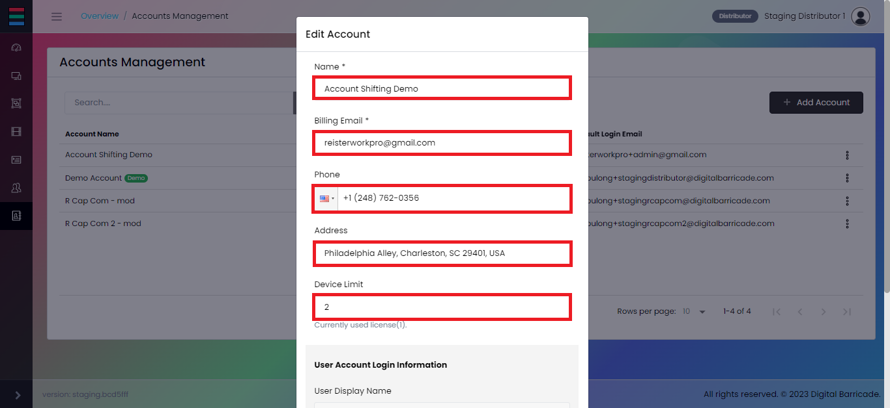

!> ディストリビューターのみがDigital Barricadeウェブサイトの[アカウント管理]タブにアクセスできます。

# アカウント管理

ユーザーによって追加されたアカウントは、様々な登録デバイスを含むデモアカウントと共に、パネルのアカウント管理タブに、アカウント名、使用ライセンス数、デフォルトメールアドレスなどの重要な詳細と共に一覧表示されます。

ユーザーアカウントにアクセス制限はなく、digital barricadeウェブサイトで利用可能なすべてのアカウントをユーザーが管理できます。
1デバイスは1ライセンスに制限されています。これは、各デバイスがソフトウェアにアクセスし、利用するためにライセンスを持っていなければならないことを保証します。

# アカウントの追加

ユーザーは、アカウント追加ボタンをクリックしたときに表示されるモーダルを設定することで、新しいアカウントを設定することができます。

ユーザは, 新規アカウントを作成するために入力フィールドに入力する必要がある。

# アカウントの編集/ライセンスの調整

ドロップダウンメニューの下にあるアカウントの編集をクリックすることで、各アカウントの情報を更新することができます。

