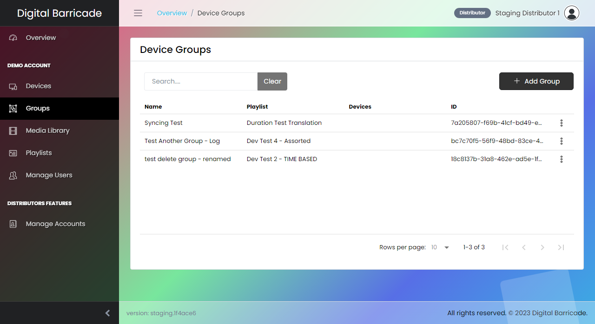
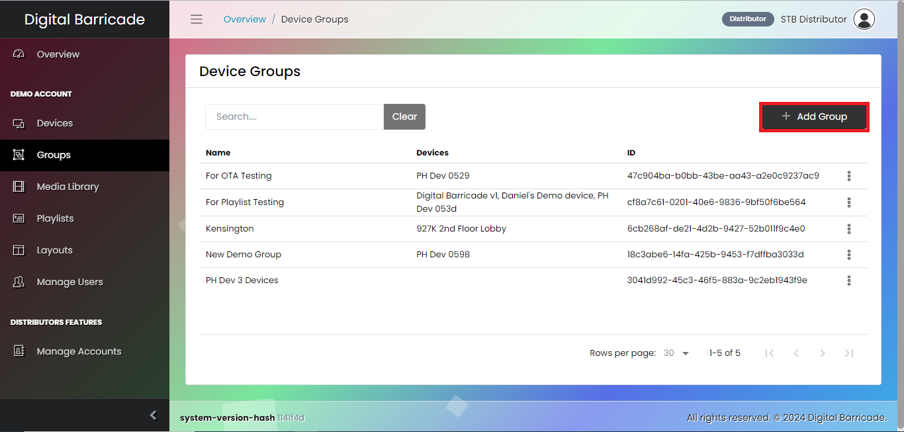
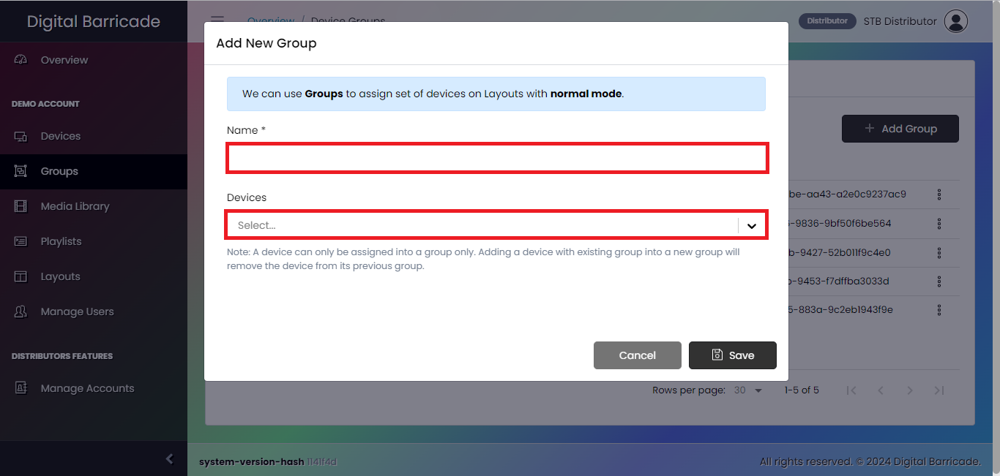
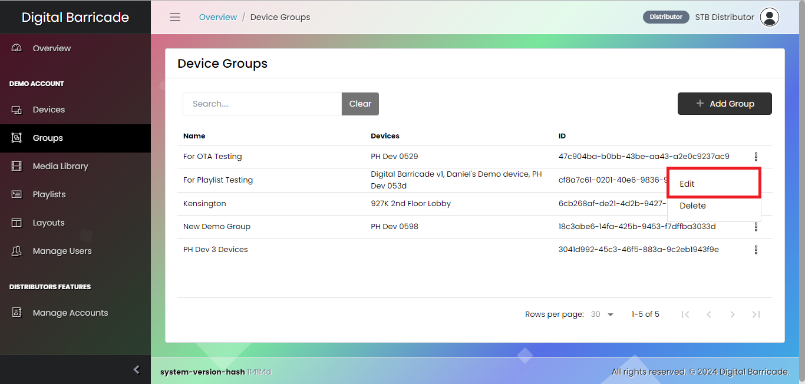
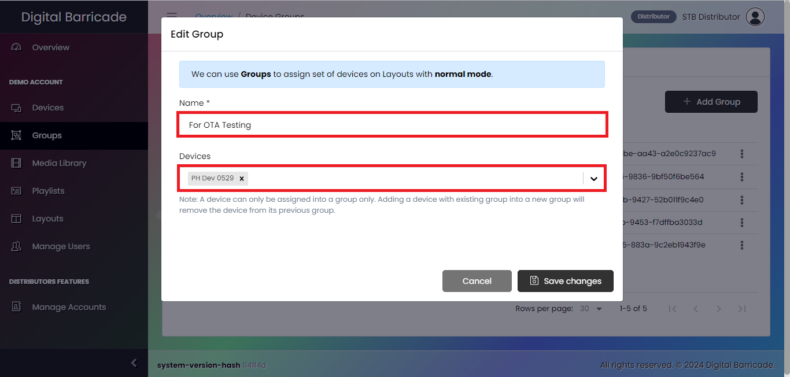
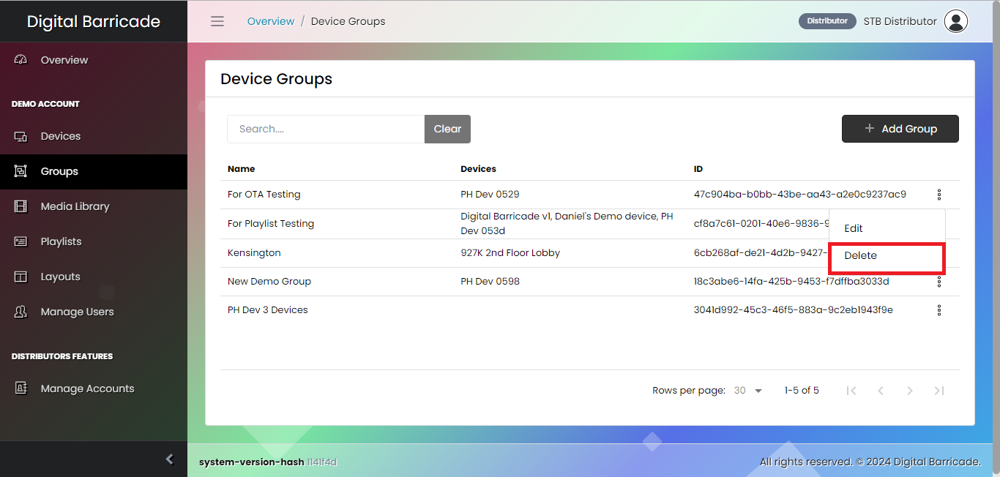

# デバイスグループ設定

パネルの[グループ]タブでは、複数のデバイスで再生されているプレイリストを確認できます。ユーザーは特定のグループ内の全デバイスのプレイリストを管理・更新することができ、再生中のコンテンツをシームレスにコントロールすることができます。ユーザーは作成したグループをパネルのグループタブで確認できます。各グループには、様々なデバイスで再生されているプレイリストが表示されます。ユーザーは、特定のグループ内の全デバイスにわたってプレイリストを管理・更新することができ、再生中のコンテンツをシームレスにコントロールすることができます。

# グループの作成

新しいグループを作成するには、デバイスグループのインターフェイスにあるグループ追加ボタンをクリックするだけです。

新しいグループを作成する際、ユーザーはグループ名を設定し、再生するプレイリストを選択し、最後に選択したプレイリストを再生するデバイスを選択する必要があります。

# グループの編集

ユーザーは、選択したグループのドロップダウンメニューから編集をクリックすることで、グループを変更することができます。ユーザーは、選択したグループの名前とプレイリストを変更し、選択したプレイリストを再生するデバイスを追加または削除することができます。

モーダルが表示されたら、ユーザーは選択したグループの名前を更新し、新しいプレイリストを選択し、選択したプレイリストを再生するデバイスを追加または削除することができます。

# グループの削除

編集オプションの下で、ユーザーはグループを削除することができます。グループの削除を確認するためのモーダルウィンドウが表示されます。

