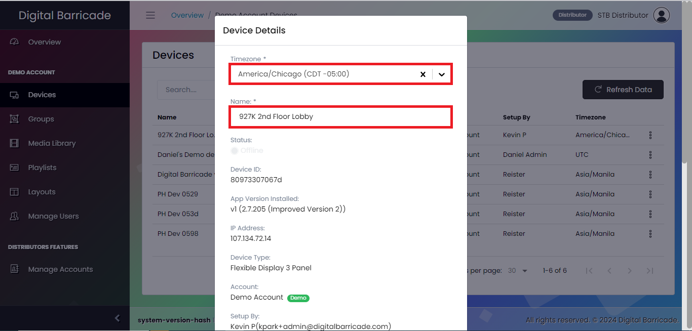
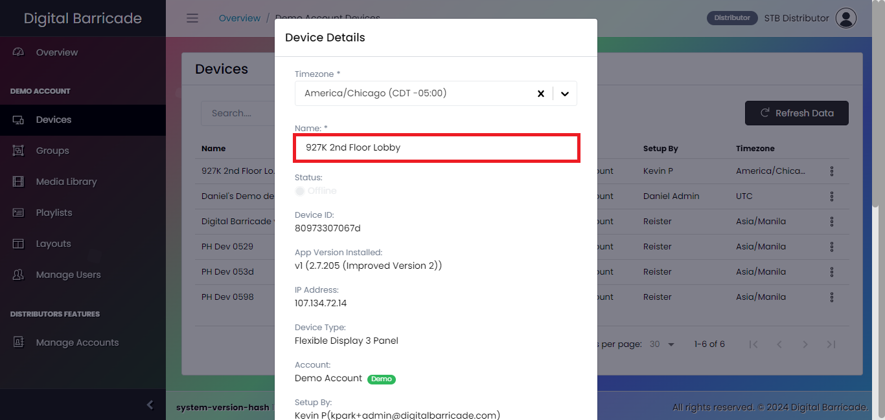
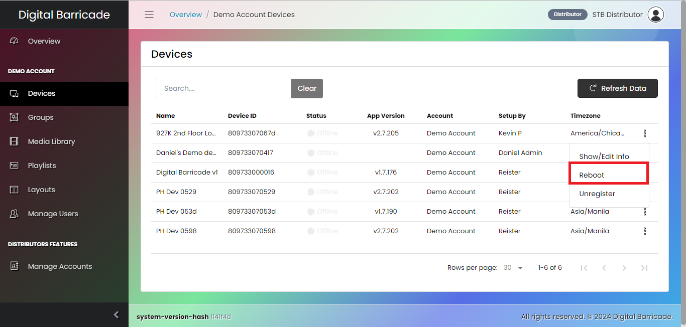

# デバイス設定

Digital Barricadeウェブサイトには左側にパネルがあり、登録された各デバイスの様々なタブを選択・設定することができます。これらの重要なタブの1つは "デバイス "タブで、登録されたすべてのデバイスのリストを表示します。デバイスインターフェイスの中で、ユーザーはデバイス設定の編集、デバイスの登録解除、必要な場合のリブートの開始など、いくつかのアクションを実行する権限を持っています。

# デバイスの編集

ドロップダウンメニューの[編集]をクリックした後にモーダルが表示されると、ユーザーは再生するプレイリストを設定したり、プレイリストの特定のタイムゾーンの再生スケジュールを選択したり、デバイスの名前を変更したり、デバイスに関するその他の重要な詳細を表示したりすることができます。デバイスを編集するには、ドロップダウンメニューの編集オプションをクリックする必要があります。

ドロップダウンメニューの "edit "をクリックすると、モーダルが表示され、デバイスを設定するための様々なオプションが表示されます。これらのオプションの中で、ユーザーは再生される現在のプレイリストを選択することができる。また、異なる地域の特定のタイムゾーンに従って再生スケジュールをカスタマイズすることもできる。

前述の機能に加えて、ユーザーはデバイスの名前を変更したり、デバイスに関する重要な情報にアクセスしたりすることもできる。この機能により、ユーザーはウェブサイトに登録されている様々なデバイスに、ユニークで認識しやすい名前を割り当てることができる。

# デバイスの再起動

ドロップダウンメニューの再起動オプションをクリックすると、デバイスが再起動され、一時的に数秒間アクセスできなくなります。再起動が完了したら、デバイスがオンライン状態になるのを待ちます。

再起動オプションをクリックすると、デバイスの再起動プロセスを確認するためのモーダルが表示されます。

# デバイスの登録解除

ドロップダウンメニューの登録解除オプションをクリックすると、そのデバイスは当社のシステムからリンク解除され、（再登録しない限り）今後のアップデートを受け取ることができなくなります。

その結果、そのデバイスは、当社が将来リリースする可能性のあるさらなるアップデートや機能拡張を受けられなくなります。ただし、後日デバイスを再登録するか、当社のシステムに再接続することを選択した場合、デバイスは再びアップデートを受ける資格を有し、当社が提供する新機能や改良の恩恵を受けることができます。

