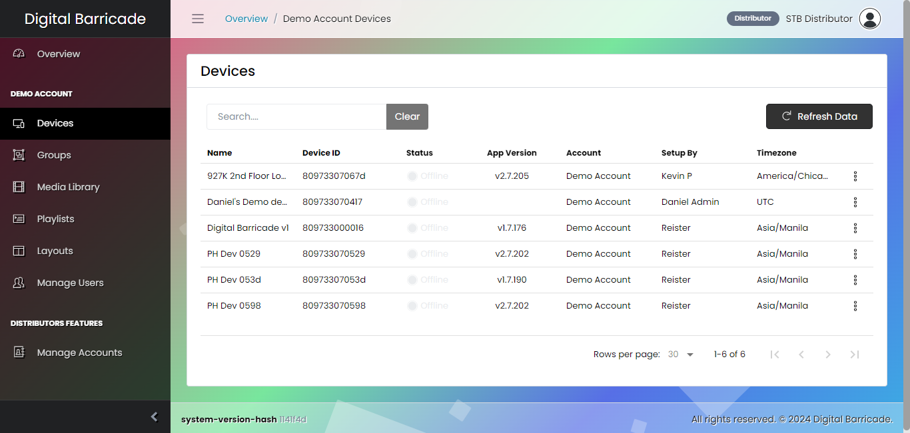
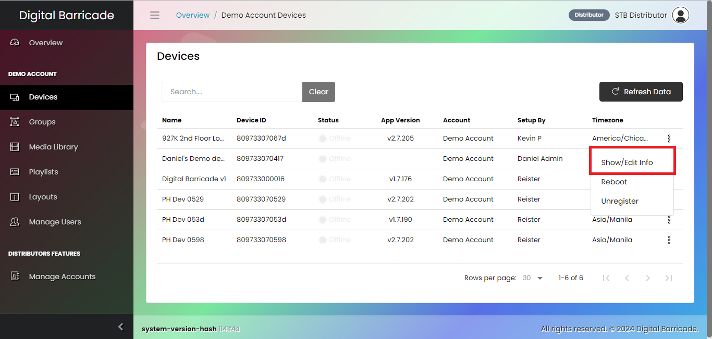

# デバイス構成

Digital Barricade Web サイトの左側にはパネルがあり、ユーザーは登録されたデバイスごとにさまざまなタブを選択して設定できます。これらの重要なタブの 1 つは [デバイス] タブで、登録されているすべてのデバイスのリストが表示されます。デバイス インターフェイス内で、ユーザーは、デバイス設定の編集、デバイスの登録解除、必要に応じた再起動の開始など、いくつかのアクションを実行する権限を持っています。

# デバイスの編集

ドロップダウン メニューの編集をクリックした後にモーダルが表示されると、ユーザーは再生される現在のプレイリストを設定したり、プレイリストの特定のタイムゾーンの再生スケジュールを選択したり、デバイスの名前を変更したり、追加の重要な情報を表示したりすることもできます。デバイスの詳細。デバイスを編集するには、ユーザーはドロップダウン メニューの編集オプションをクリックする必要があります。

ユーザーがドロップダウン メニューの [編集] をクリックすると、モーダルが表示され、デバイスを構成するためのさまざまなオプションが表示されます。これらのオプションの中から、ユーザーは再生される現在のプレイリストを選択できます。また、さまざまな地域の特定のタイムゾーンに従って再生スケジュールをカスタマイズすることもできます。

前述の機能に加えて、ユーザーはデバイスの名前を変更したり、それに関連する重要な情報にアクセスしたりすることもできます。この機能を使用すると、ユーザーは Web サイトに登録されているさまざまなデバイスに一意で認識可能な名前を割り当てることができます。

# デバイスを再起動する

ドロップダウン メニューで再起動オプションをクリックすると、デバイスが再起動され、数秒間一時的にアクセスできなくなります。再起動が完了したら、デバイスがオンライン ステータスを示すまで待ち ​​ ます。

再起動オプションをクリックすると、デバイスの再起動プロセスを確認するモーダルが表示されます。

