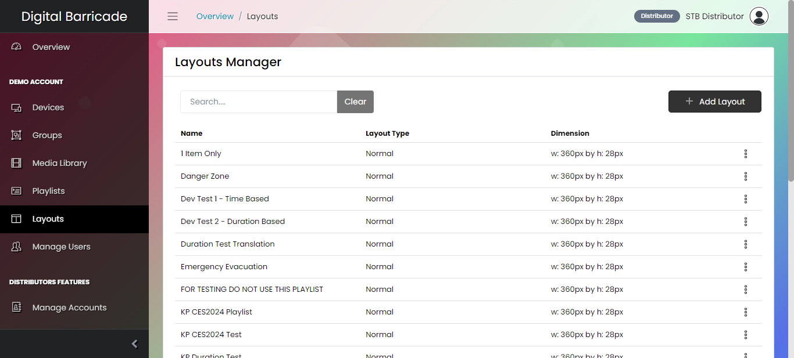
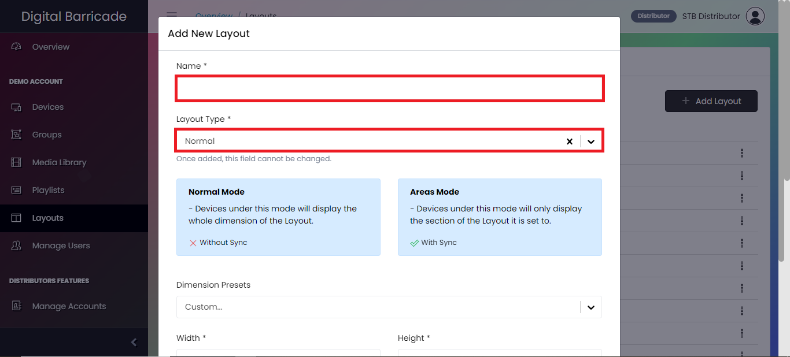
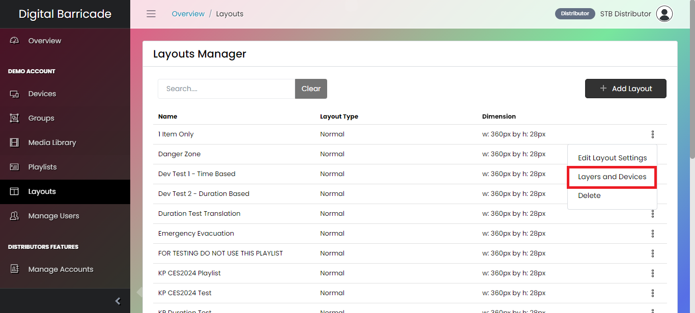
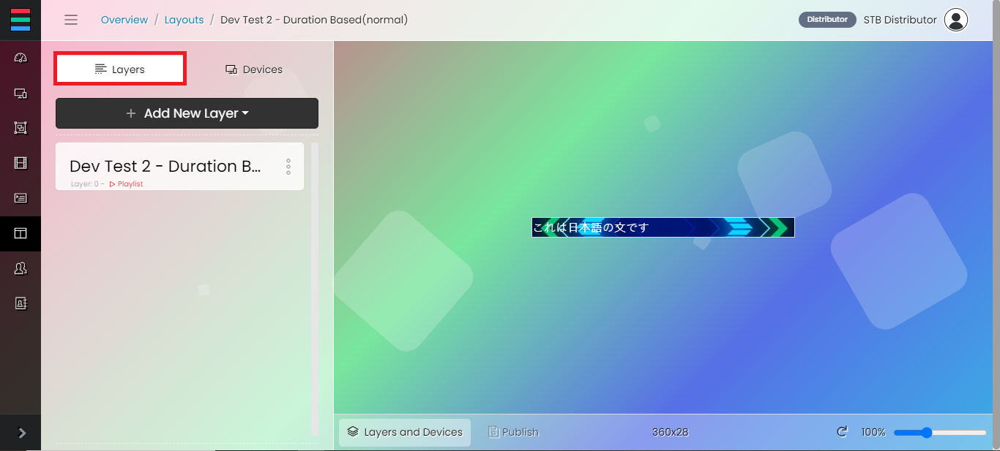
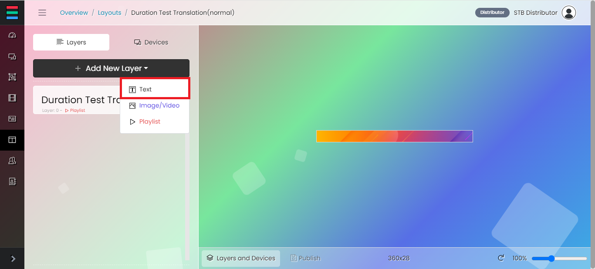
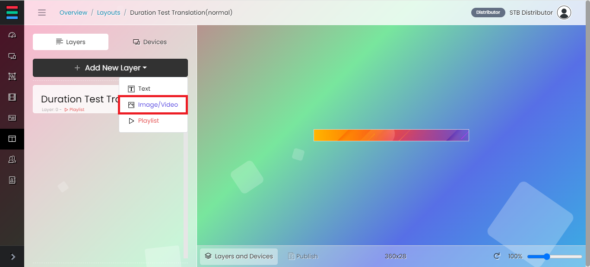
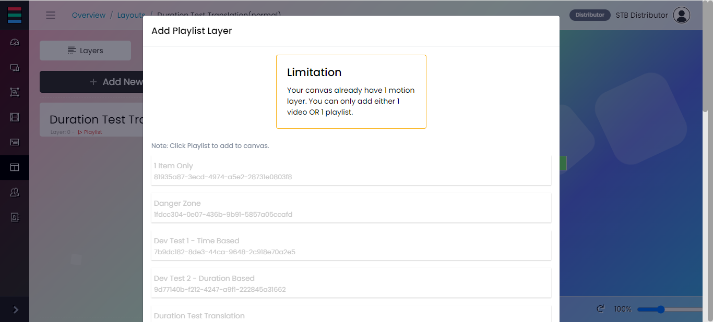
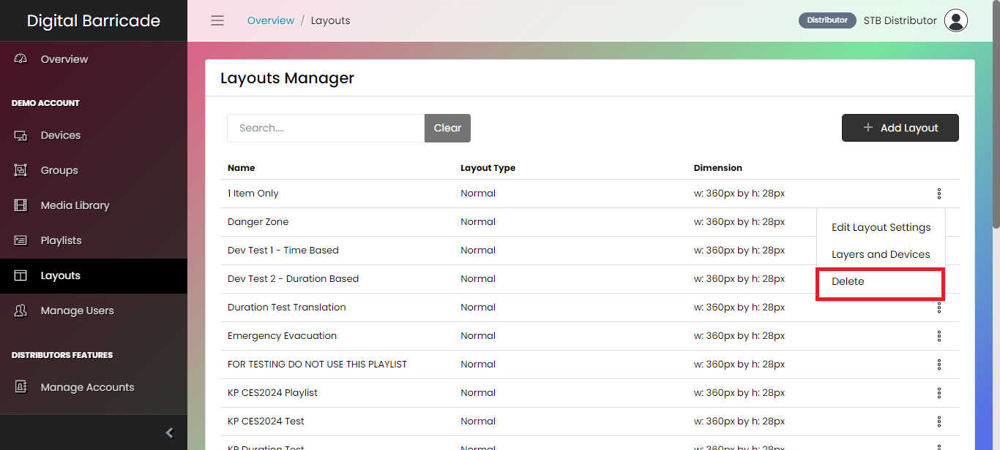

# レイアウト・マネージャー

レイアウトマネージメントページは、デジタルメディアを編集、配置、設定し、配置可能なレイアウトにするためのページです。ここでは、テキスト、イメージ、ビデオ、プレイリストなど、さまざまなタイプのメディアを扱えるキャンバスが用意されています。これらは、2つのレイアウトタイプのいずれかに整理できます： ノーマルモードはレイアウト全体をデバイスに表示し、エリアモードは主に同期表示用に、あらかじめ定義されたエリア内にメディアを配置します。そして、レイアウトを特定のデバイスまたはデバイスのグループに公開することができます。

# レイアウトの追加

新しいレイアウトを追加するには、レイアウト追加ボタンをクリックするだけで、モーダルが表示されます。

レイアウトの名前を入力します。レイアウトのタイプを「ノーマル」と「エリア」から選択する。レイアウトタイプの選択はレイアウト作成時にのみ行われ、編集モードでは変更できません。

ドロップダウンから利用可能な寸法プリセットを選択します。保存ボタンを押す前に、レイアウトの幅と高さを設定します。

# レイアウト設定の編集

レイアウトを設定するには、ドロップダウンにあるレイアウト設定の編集オプションを押します。

モーダルが表示されたら、レイアウトタイプ以外のフィールドを設定および更新します。

# レイヤーとデバイス

作成したレイアウトに移動し、レイヤー、デバイス、デバイスグループを追加するには、選択したレイアウトのレイヤーとデバイスオプションを押します。

# レイヤー

デフォルトでアクティブなタブは、テキスト、メディア、プレイリストのレイヤーで構成される「レイヤー」です。

新しいテキストレイヤーを追加するには、新しいレイヤーを追加ボタンを押した後、ドロップダウンの下にあるテキストオプションを押してください。

モーダルが表示されたら、レイヤーの名前を入力します。テキストは異なる言語に翻訳することができますが、オプションは限られています。ユーザーは、テキストがアクティブかどうか、反転するかどうかを設定できます。レイヤーのサイズを変更するには、幅と高さのデフォルト値を変更します。テキストレイヤーのフォントサイズ、フォントスタイル、フォントカラー、背景色を選択します。

新しいメディアレイヤーを追加するには、新規レイヤーの追加ボタンを押した後、ドロップダウンの下にある画像/ビデオオプションを押します。

ユーザーがメディアレイヤーを追加すると、メディアライブラリにアップロードされたメディアがモーダルに表示されます。

新しいプレイリスト・レイヤーを追加するには、新規レイヤー追加ボタンを押した後、ドロップダウンの下のプレイリスト・オプションを押してください。

プレイリスト・ページで作成したプレイリストは、画像とテキストを組み合わせた複数のメディアを再生するレイアウトで使用できます。

レイヤーを編集するには、3ドットのアイコンをクリックすると、編集オプションが表示されます。

レイヤーは、タブのオプションを使用して設定できます。

一部の設定（変更時）は自動的にキャンバスに適用されません。変更を適用するには、「寸法と位置を適用」ボタンを押してください。レイアウトの寸法が大きい場合は、スライドバーを使ってレイアウト全体が見えるように調整することができます。

# 通常モードのデバイス（同期なし）

Devices "タブ（"Normal "モード）では、個々のデバイスとデバイス・グループの両方を追加するオプションがあります。追加されたデバイスは、同期なしでレイアウト・キャンバスの全領域を表示します。

# エリアモードのデバイス（同期あり）

Devicesタブ（Areasモード）では、個々のデバイスを追加するオプションしかありません。追加されたデバイスは、指定したレイアウトキャンバスのエリアを表示します。

最初に追加されたデバイスは、同じネットワーク内に接続されているすべてのデバイスの「コントローラー」として指定されます。コントローラーを変更するには、3つの点のアイコンをクリックし、メニューから「コントローラーとして設定」オプションを選択します。

また、3つの点のアイコンをクリックし、メニューから "Edit "オプションを選択することで、レイアウトキャンバスのデバイスの位置と寸法を更新することができます。

# コンテンツの公開

変更が加えられると、Publishボタンに黄色いバッジが表示されます。このボタンをクリックすると、変更が保存され、指定したデバイスにデプロイされます。

# レイアウトの削除

レイアウトを削除するには、レイアウトを選択し、3ドットのアイコンをクリックし、ドロップダウンメニューから削除オプションを押します。

モーダルが表示されたら、continue deleteボタンを押してください。

