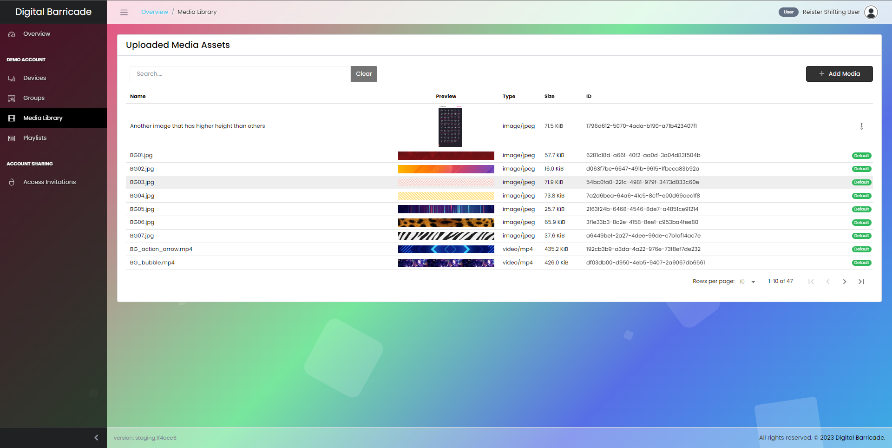
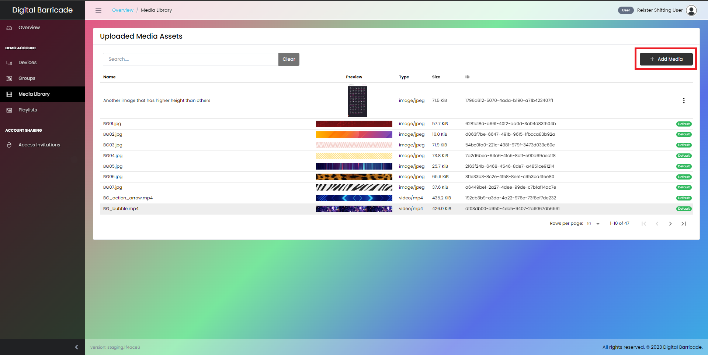
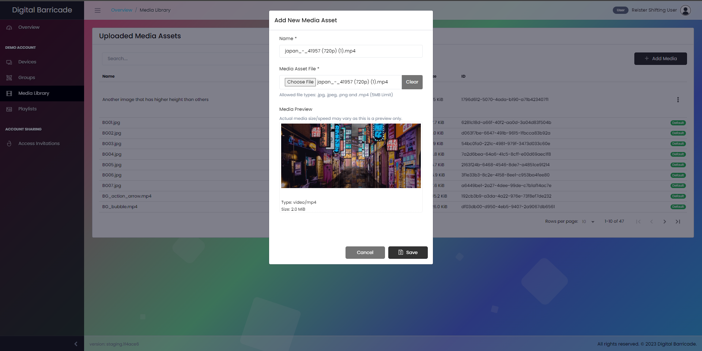
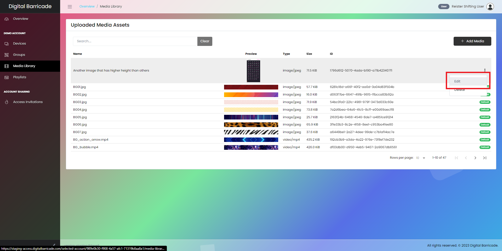
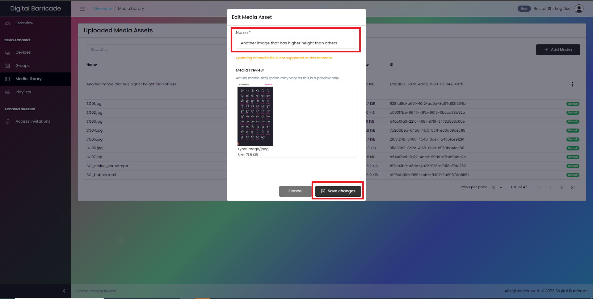
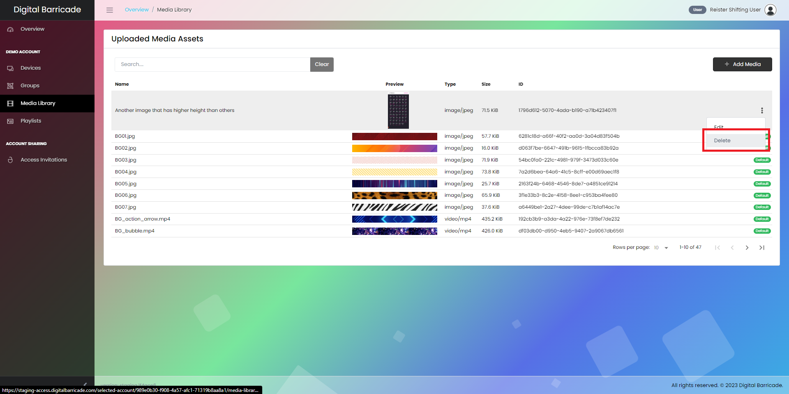
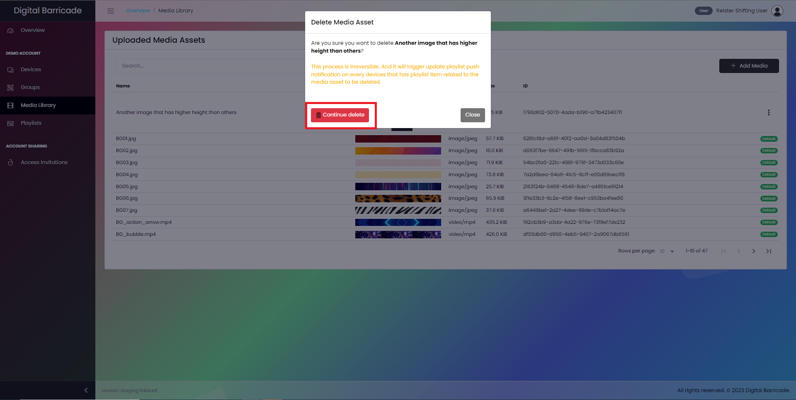

# メディア管理

ユーザーは、パネルのメディア ライブラリ タブを通じて、画像とビデオの両方で構成されるアップロードされたメディアにアクセスできます。アップロードされたメディアは、新しいプレイリストの作成に利用されます。

# メディアアセットの追加

ユーザーには、[メディアの追加] ボタンを選択し、希望の名前とメディアの種類 (写真またはビデオ) を入力することで、新しいメディアをアップロードするオプションがあります。メディアを追加するには、図で示されているように、[メディアの追加] ボタンをクリックします。

モーダル ウィンドウが表示され、ユーザーが [ファイルを選択] ボタンを押して、アップロードするメディア ファイルを選択します。「クリア」をクリックしてファイルを削除し、別のファイルを選択することもできます。[保存] をクリックしてメディア ファイルを確認します。

# メディアアセットの編集

アップロードされたメディアに変更を加えるには、ドロップダウン メニューから編集オプションを選択するだけです。ユーザーはメディアの名前を変更することはできますが、アップロードされたメディア自体を変更することはできません。

メディア名に加えた変更を保存するには、「変更を保存」ボタンをクリックします。

# メディア資産の削除

[編集] オプションで、ユーザーはカスタム メディアを削除できます。これを行うには、[削除] オプションを選択すると、モーダル ウィンドウが開き、メディアの削除を確認し、[削除を続行] ボタンをクリックします。

