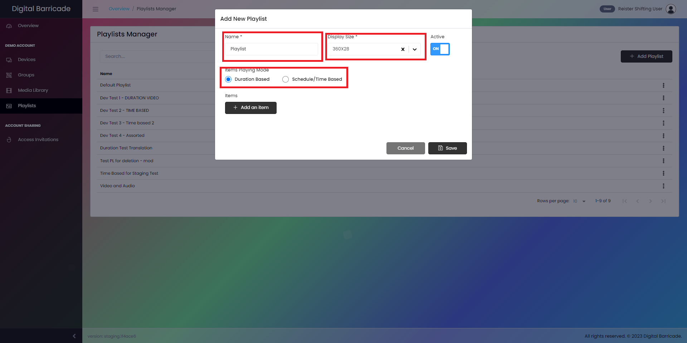
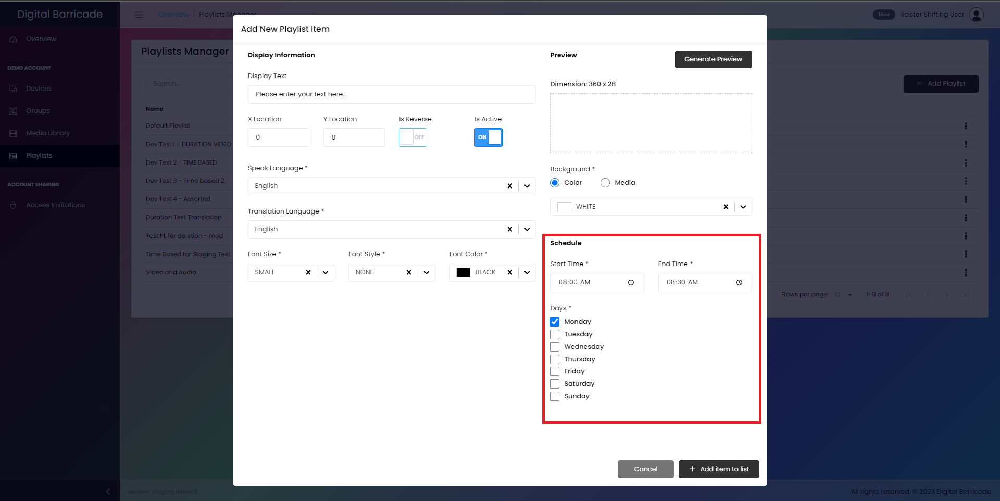
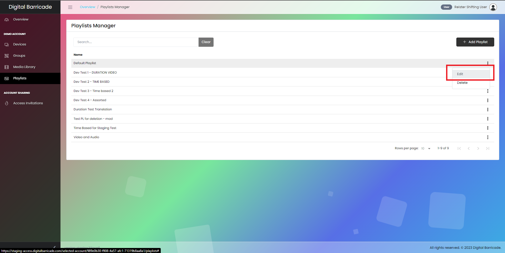
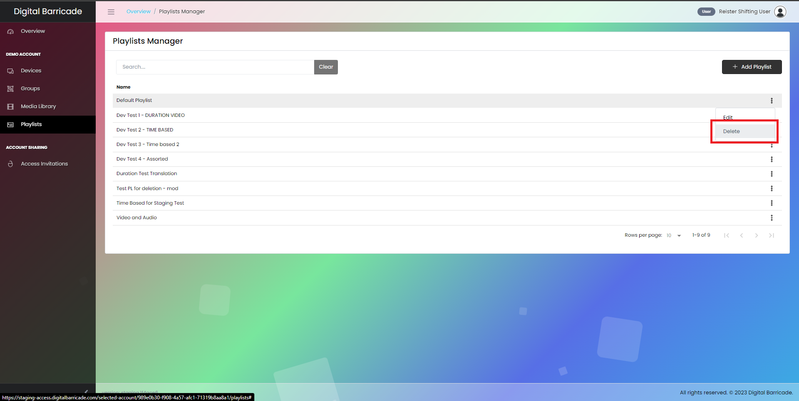

# プレイリスト管理

プレイリスト マネージャーには、グループの作成時に使用されるプレイリストが含まれており、アップロードされたメディアがここで使用されます。左側のパネルでプレイリストが選択されている場合、ユーザーにはこの画面が表示されます。ここで、ユーザーは自分のアカウントで作成され利用可能なすべてのプレイリストを表示できるようになります。このページでは、ユーザーは新しいプレイリストの作成、既存のプレイリストの設定、プレイリストの削除を行うことができます。

# プレイリストの作成

新しいプレイリストを作成するには、図で示されているように [プレイリストの追加] ボタンをクリックします。

ユーザーには、プレイリストの名前とその表示サイズを指定するオプションがあります。ユーザーがプレイリストを作成するとき、再生モードを選択する必要があります。使用可能なオプションは 2 つあります。1 つは継続時間ベース (デフォルトの継続時間は 20 秒)、もう 1 つはスケジュール/時間ベースです。後者のモードでは、ユーザーは月曜日から日曜日までプレイリストがいつ再生されるかのタイムテーブルを設定できます。さらに、ユーザーはプレイリストがアクティブになる毎日の正確な時間を指定できます。

[項目を追加] ボタンをクリックすると、プレイリストをカスタマイズするためのさまざまなオプションを表示する新しいウィンドウが表示されます。これらのオプションには、重要な情報を効果的に表示する表示テキストを設定する機能が含まれています。ユーザーは、X 座標と Y 座標を使用して表示テキストの位置を調整できます。さらに、反転スイッチを使用してディスプレイの向きを反転できます。プレイリストのステータスを制御するために、プレイリストが現在アクティブかどうかを示すアクティブ スイッチがあります。

さらに、モーダルにはドロップダウン メニューが組み込まれており、ユーザーが話し言葉や書き言葉に使用する言語を選択できるため、自動翻訳が可能になります。ユーザーは、フォントのサイズ、スタイル、色を調整して、表示されるテキストの外観をカスタマイズして、希望の結果を得ることができます。また、テキストに異なる背景色を選択したり、アップロードされたメディア アセットを背景として使用して視覚的な魅力を高めることもできます。加えられた変更をプレビューするには、ユーザーはプレビューの再読み込みボタンをクリックするだけで、適用された変更によって表示テキストがどのように表示されるかを確認できます。

# 期間ベース

ユーザーが [期間ベース] オプションを選択した場合、このモーダル ウィンドウが表示され、言語、表示するテキスト、フォント サイズ、フォント スタイル、およびフォントの色を選択できます。期間ベースの場合は、この項目の期間が表示されます。デバイスで再生します。

ユーザーが加えた変更を確認したい場合は、「プレビューの生成」ボタンを押して変更のプレビューを表示し、項目をプレイリストに追加するには「項目をリストに追加」ボタンを押す必要があります。

# スケジュール/時間ベース

ユーザーがスケジュール/時間ベースのオプションを選択した場合、このモーダル ウィンドウが表示され、言語、表示するテキスト、フォント サイズ、フォント スタイル、フォントの色、スケジュール/時間ベースの曜日、およびスケジュールを選択できます。アイテムの特定の開始時間と終了時間が再生されます。

ユーザーが加えた変更を確認したい場合は、「プレビューの生成」ボタンを押して変更のプレビューを表示し、項目をプレイリストに追加するには「項目をリストに追加」ボタンを押す必要があります。

次に、ユーザーが変更に満足したら、新しく作成したプレイリストを追加/保存します。「保存」ボタンをクリックします。

# プレイリストの編集

[編集] オプションを選択すると、ユーザーはこのモーダル ウィンドウに移動し、プレイリストの名前、表示サイズ、再生モードを変更したり、時間ベースのプレイリストの時間の変更や継続時間の変更などの個々の項目を編集したりできます。ベースのプレイリスト。

プレイリストに加えた変更を保存するには、[変更を保存] ボタンをクリックします。これにより、このプレイリストを持つデバイスのコンテンツが自動的に更新されます。

# プレイリストを削除する

[編集] オプションで、ユーザーはプレイリストを削除できます。これを行うには、[削除] オプションを選択すると、モーダル ウィンドウが開き、プレイリストの削除を確認し、[削除を続行] ボタンをクリックします。

