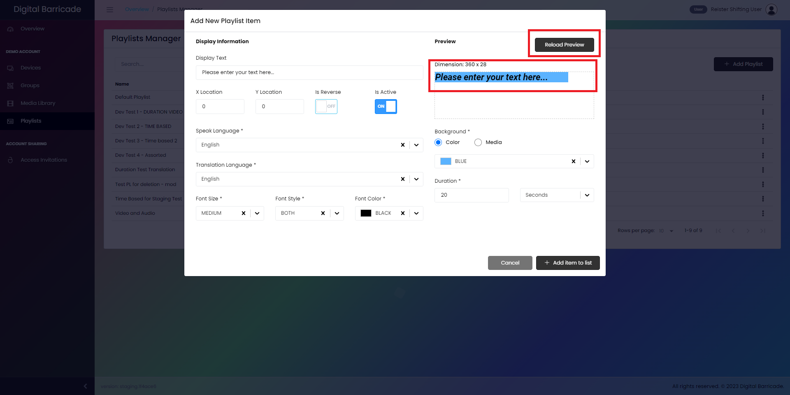
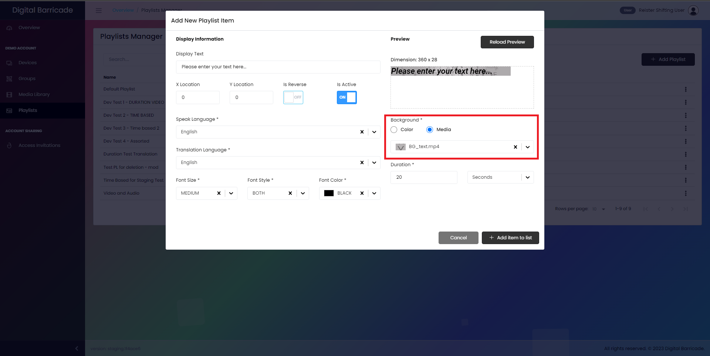

# プレイリスト管理

プレイリストマネージャーはグループ作成時に使用されるプレイリストを含み、アップロードされたメディアはここで利用されます。プレイリストが選択された場合、左サイドパネルにこの画面が表示されます。ここでユーザーは自分のアカウントで作成され、利用可能な全てのプレイリストを見ることができます。このページで、ユーザーは新しいプレイリストを作成し、既存のプレイリストを設定し、プレイリストを削除することができます。

# プレイリストの作成

新しいプレイリストを作成するには、図のようにプレイリスト追加ボタンをクリックします。

ユーザーは、プレイリストの名前と表示サイズを指定するオプションがあります。ユーザーがプレイリストを作成する際、再生モードを選択する必要があります。デフォルトが20秒のデュレーション・ベースとスケジュール/タイム・ベースの2つのオプションがある。後者のモードでは、月曜日から日曜日までプレイリストを再生するタイムテーブルを設定できる。さらに、ユーザーはプレイリストがアクティブになる各日の正確な時間を指定することができます。

アイテムの追加ボタンをクリックすると、プレイリストをカスタマイズするための様々なオプションを表示する新しいウィンドウに移動します。これらのオプションには、重要な情報を効果的に表示する表示テキストを設定する機能が含まれています。ユーザーは、X座標とY座標を使用して表示テキストの位置を調整することができます。さらに、リバーススイッチを使って、ディスプレイの向きを逆にすることもできる。プレイリストのステータスをコントロールするために、プレイリストが現在アクティブかどうかを示すアクティブスイッチがあります。

さらに、モーダルには、ユーザーが話し言葉や書き言葉の言語を選択できるドロップダウンメニューがあり、自動翻訳が可能です。ユーザーは、フォント サイズ、スタイル、および色を調整することによって、表示されるテキストの外観をカスタマイズして、希望する結果を得ることができます。彼らはまたテキストのための異なった背景色を選ぶか、または視覚訴求を高めるのに背景としてアップロードされた媒体資産を使用してもいい。変更をプレビューするには、リロードプレビューボタンをクリックするだけです。

# 期間ベース

ユーザーが[継続時間ベース]オプションを選択した場合、このモーダルウィンドウが表示され、言語、表示するテキスト、フォントサイズ、フォントスタイル、フォントカラーを選択することができます。

ユーザーが変更した内容を確認したい場合は、プレビュー生成ボタンを押して、変更した内容のプレビューを確認する必要があります。アイテムをプレイリストに追加するには、リストにアイテムを追加ボタンを押す必要があります。

# スケジュール/時間ベース

ユーザーがスケジュール/時間ベースのオプションを選択した場合、このモーダルウィンドウが表示され、言語、表示されるテキスト、フォントサイズ、フォントスタイル、フォントカラーを選択することができます。

ユーザーが変更した内容を確認したい場合は、プレビューを生成ボタンを押して、変更した内容のプレビューを見る必要があります。アイテムをプレイリストに追加するには、リストにアイテムを追加ボタンを押す必要があります。

それから、保存ボタンをクリックして、新しく作成されたプレイリストを追加／保存してください。

# プレイリストの編集

編集オプションを選択することにより、ユーザーはこのモーダルウィンドウに移動し、プレイリストの名前、表示サイズ、再生モードを変更し、鉛筆アイコンをクリックすることにより、時間ベースのプレイリストの時間を変更したり、デュレーションベースのプレイリストのデュレーションを変更したり、アイテムを追加ボタンをクリックすることにより、新しいアイテムを追加し、オン／オフアクティブスイッチをクリックすることにより、プレイリストがアクティブかどうかを示すことができます。

更新ボタンをクリックして、プレイリストの変更を保存します。これにより、どのデバイス上のプレイリストも自動的に更新されます。

# プレイリストの削除

編集オプションで、ユーザーはプレイリストを削除することができます。削除オプションを選択すると、プレイリストの削除を確認するためのモーダルウィンドウが開き、[削除を続行]ボタンをクリックします。

