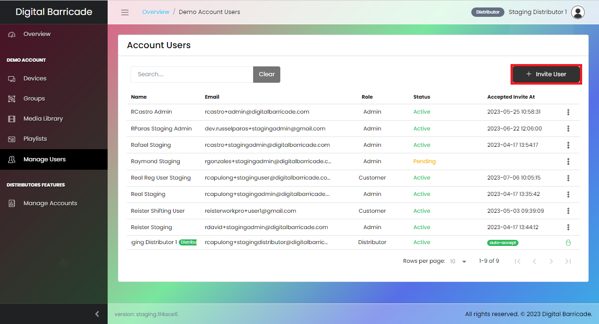
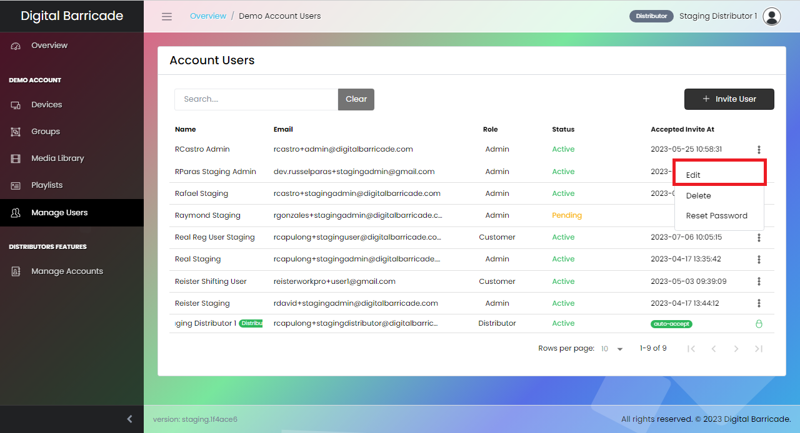
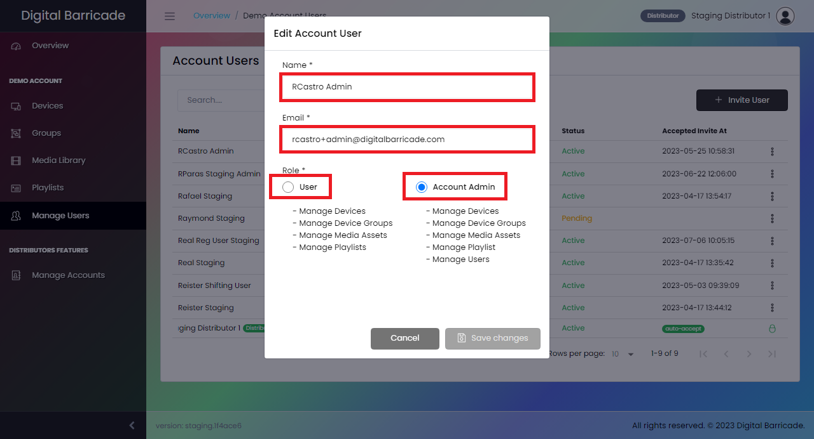
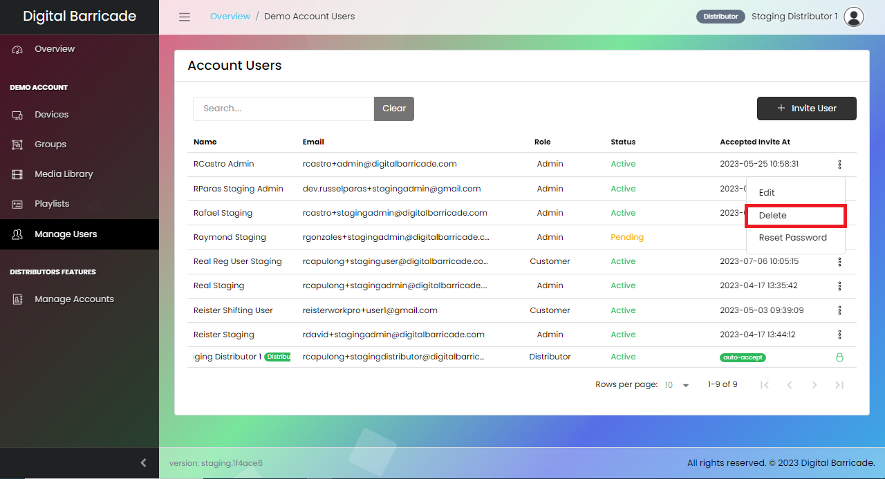
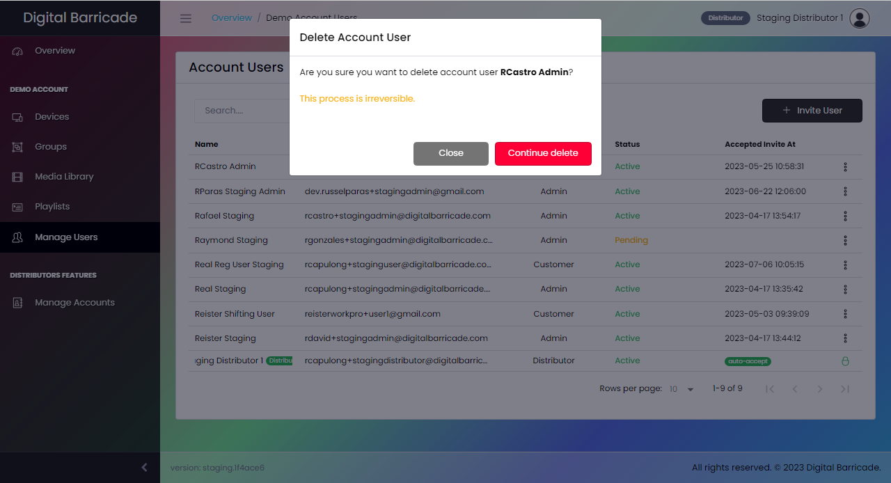
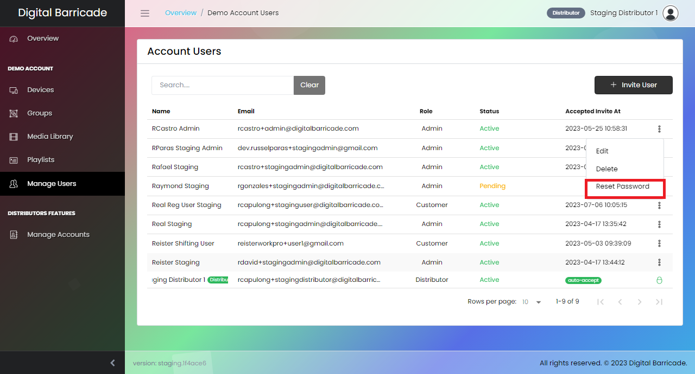
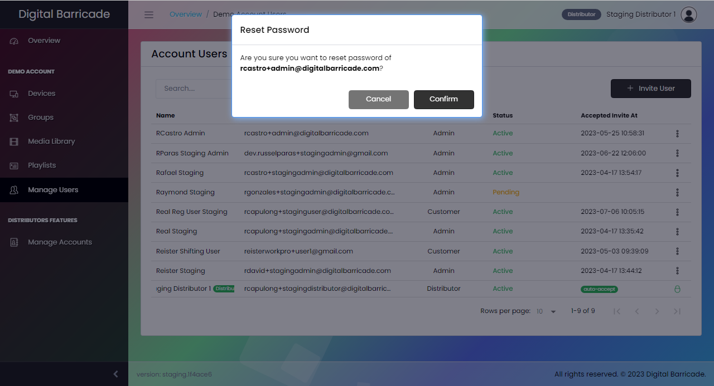

# アカウントユーザー管理

パネルの「ユーザーの管理」タブで、管理者は各アカウント ユーザーを監視できます。ここで管理者は、各アカウント ユーザーの名前、電子メール、特定のロール、ステータスを表示できます。

ユーザー アカウントと管理者アカウントは互いに若干異なります。ユーザーアカウントはアカウント共有にアクセスできませんが、管理者アカウントはアクセスできるため、どのアカウントが共有されているかを確認できます。ユーザー アカウントを介してアクセスできるのは、デバイス、グループ、メディア ライブラリ、およびプレイリストのみです。

# 新しいユーザーを招待する

ディストリビュータと管理者は、アカウント ユーザー インターフェイスの [ユーザーを招待] ボタンをクリックして、新しいユーザーを追加できます。モーダルが表示され、ディストリビューターと管理者は名前と電子メール アドレスを入力し、ユーザーまたは管理者の役割を選択する必要があります。新しく招待されたユーザー アカウントは、指定された役割に限定されたデジタル バリケード Web サイト内を移動できます。

# ユーザーアカウントの編集

ディストリビュータと管理者は、ユーザー/顧客および管理者アカウントのパスワードの更新、削除、リセットなどのアカウントを管理できます。

# ユーザーアカウントの削除

ディストリビュータと管理者は、選択したユーザー アカウントの名前を変更し、自分の役割を管理者からユーザーに、またはその逆に更新できます。

# ユーザーアカウントの削除

ディストリビュータは、ドロップダウン メニューの削除オプションをクリックした後にモーダルが表示されると、選択したユーザー アカウントを削除できます。

# パスワードを再設定する

ディストリビュータと管理者は、選択したアカウントのパスワードをリセットできます。パスワードのリセット メッセージがアカウントの電子メールに送信されます。

