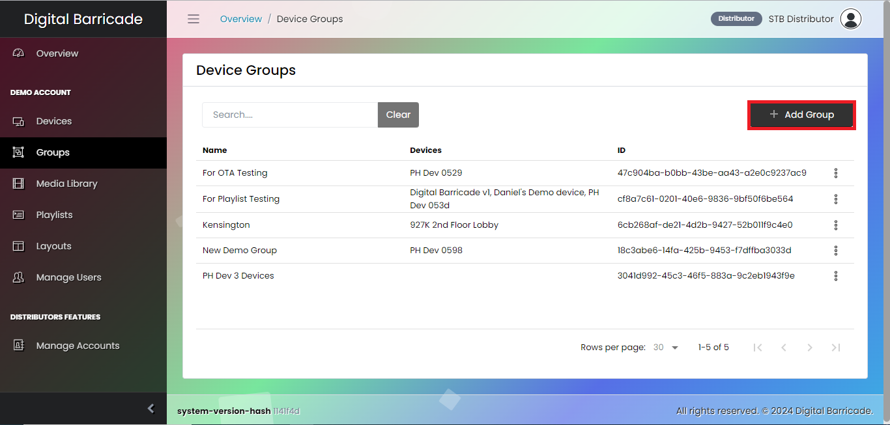

# 장치 그룹 구성

패널의 그룹 탭에서 사용자는 여러 디바이스에서 재생 중인 재생 목록을 확인할 수 있습니다. 사용자는 특정 그룹에 속한 모든 디바이스에서 재생 목록을 관리하고 업데이트하여 재생 중인 콘텐츠를 원활하게 제어할 수 있습니다. 사용자는 패널의 그룹 탭에서 생성된 그룹을 볼 수 있습니다. 각 그룹에는 다양한 장치에서 재생 중인 재생 목록이 표시됩니다. 사용자는 특정 그룹에 속한 모든 디바이스에서 재생 목록을 관리하고 업데이트할 수 있어 재생 중인 콘텐츠를 원활하게 제어할 수 있습니다.

# 그룹 생성

새 그룹을 만들려면 디바이스 그룹 인터페이스에서 그룹 추가 버튼을 클릭하기만 하면 됩니다.

새 그룹을 만들 때 사용자는 그룹 이름을 설정하고, 재생할 재생 목록을 선택하고, 마지막으로 선택한 재생 목록을 재생할 디바이스를 선택해야 합니다.

# 그룹 편집

사용자는 선택한 특정 그룹의 드롭다운 메뉴에서 수정을 클릭하여 그룹을 수정할 수 있습니다. 이제 사용자는 선택한 그룹의 이름과 재생 목록을 변경하고 선택한 재생 목록을 재생할 디바이스를 더 추가하거나 제거할 수 있습니다.

모달이 나타나면 사용자는 선택한 그룹의 이름을 업데이트하고, 새 재생 목록을 선택하고, 선택한 재생 목록을 재생할 장치를 더 추가하거나 제거할 수 있습니다.

# 그룹 삭제

수정 옵션에서 사용자는 그룹을 삭제할 수 있습니다. 이렇게 하려면 드롭다운에서 삭제 옵션을 선택하면 그룹 삭제를 확인할 수 있는 모달 창이 열립니다.

