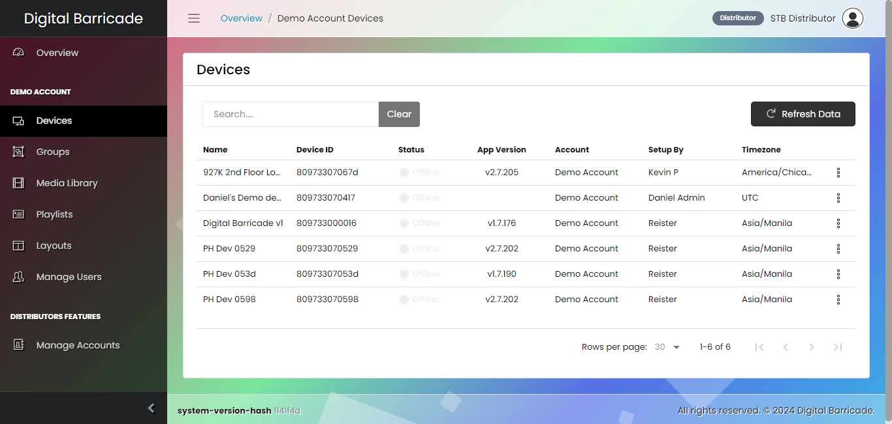
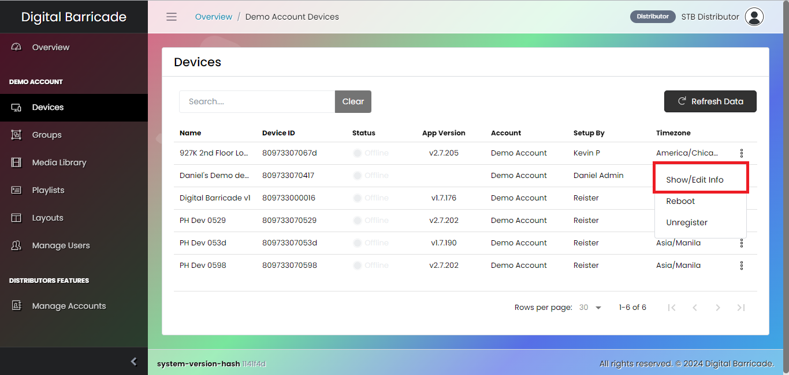
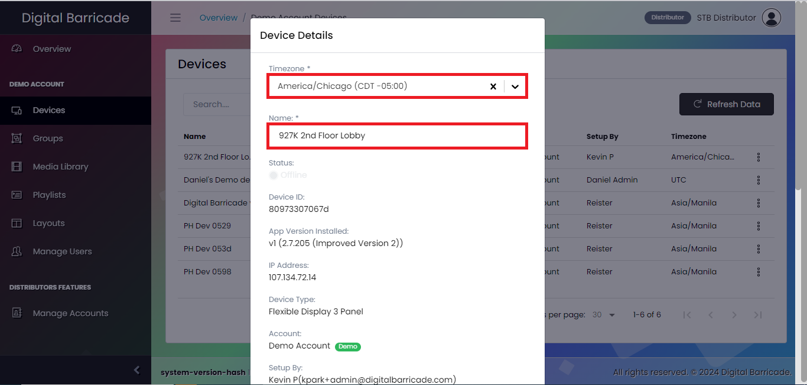
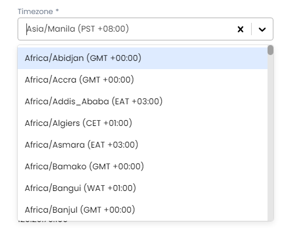
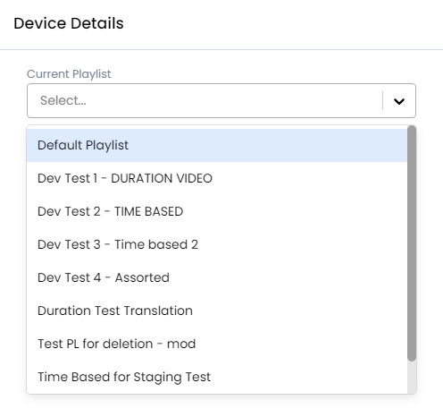
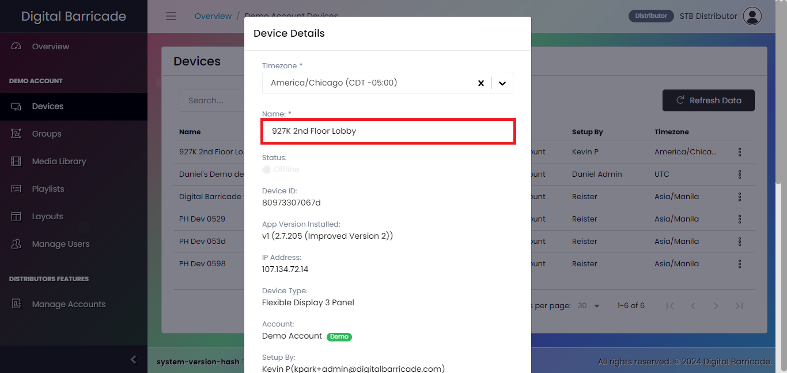
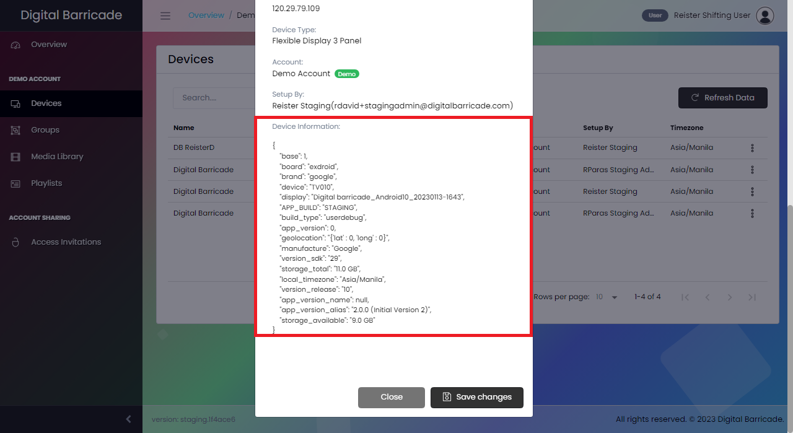
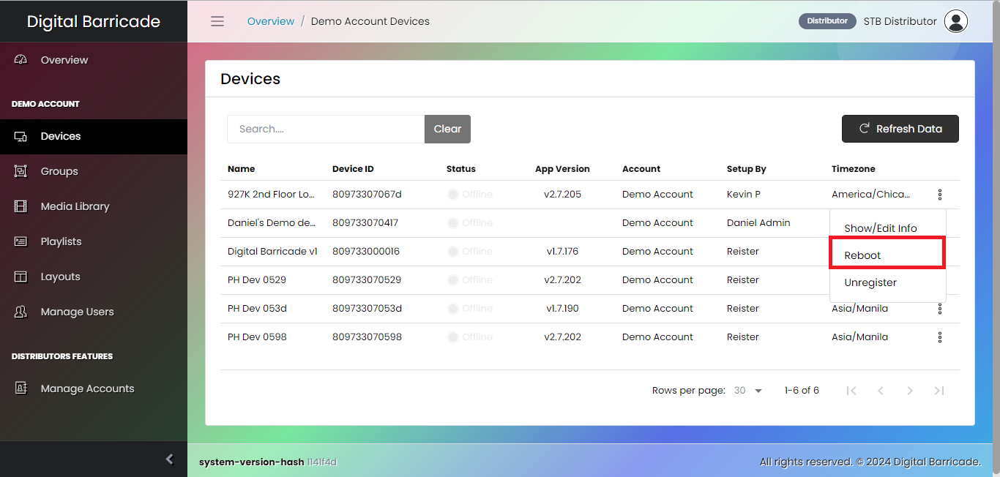
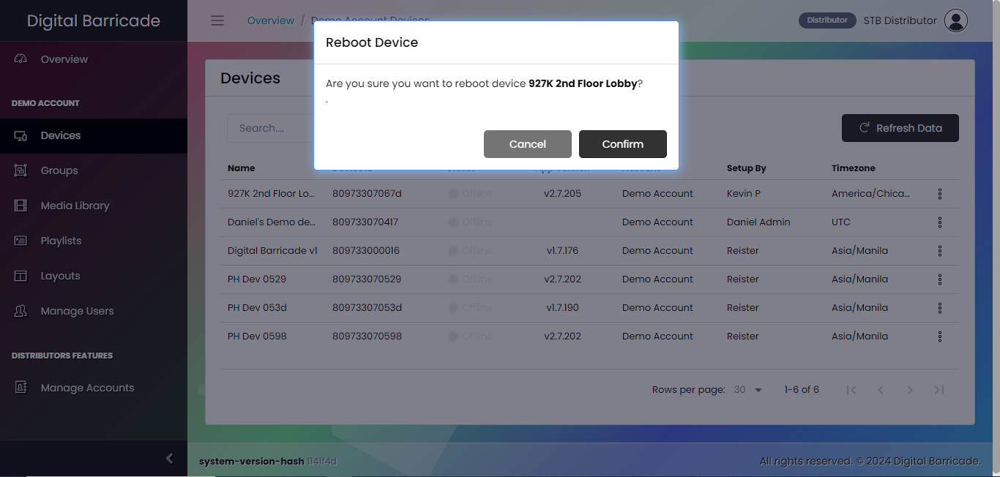

# 디바이스 구성

디지털 바리케이드 웹사이트의 왼쪽에는 사용자가 등록된 각 디바이스에 대해 다양한 탭을 선택하고 구성할 수 있는 패널이 있습니다. 이러한 필수 탭 중 하나는 등록된 모든 디바이스 목록을 표시하는 "디바이스" 탭입니다. 장치 인터페이스에서 사용자는 장치 설정 편집, 장치 등록 취소, 필요 시 재부팅 시작 등 여러 가지 작업을 수행할 수 있는 권한이 있습니다.

# 장치 편집

드롭다운 메뉴에서 수정을 클릭한 후 모달이 나타나면 사용자는 재생할 현재 재생 목록을 설정할 수 있으며, 재생 목록의 특정 시간대에 대한 재생 일정을 선택하고, 디바이스 이름을 변경하고, 디바이스에 대한 추가 중요 세부 정보를 볼 수도 있습니다. 디바이스를 수정하려면 드롭다운 메뉴에서 수정 옵션을 클릭해야 합니다.

사용자가 드롭다운 메뉴에서 편집을 클릭하면 디바이스를 구성할 수 있는 다양한 옵션이 표시되는 모달이 나타납니다. 이러한 옵션 중에서 사용자는 재생할 현재 재생 목록을 선택할 수 있습니다. 또한 여러 지역의 특정 시간대에 따라 재생 일정을 사용자 지정할 수도 있습니다.

언급 된 기능 외에도 사용자는 장치 이름을 변경하고 장치와 관련된 중요한 정보에 액세스 할 수 있습니다. 이 기능을 통해 사용자는 웹사이트에 등록된 여러 장치에 고유하고 알아볼 수 있는 이름을 지정할 수 있습니다.

# 장치 재부팅

드롭다운 메뉴에서 재부팅 옵션을 클릭하면 장치가 재시작되고 몇 초 동안 일시적으로 액세스할 수 없습니다. 재부팅이 완료되면 장치에 온라인 상태가 표시될 때까지 기다립니다.

재부팅 옵션을 클릭하면 장치의 재부팅 프로세스를 확인하는 모달이 표시됩니다.

