# Layouts Manager

The user can create a layout which can play the uploaded media from the media library, insert text, or display the playlists. 

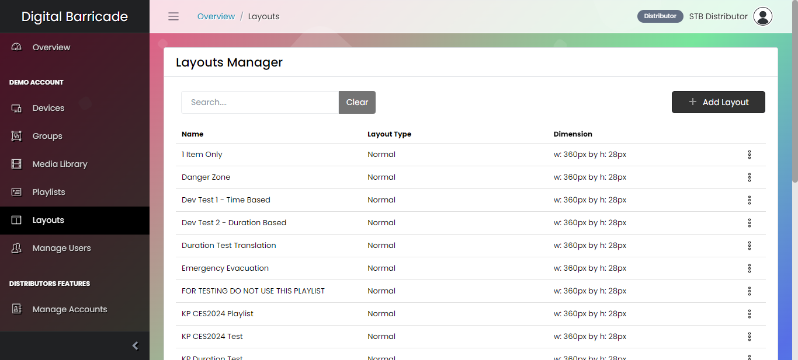

# Add Layout

To add a new layout, simply click the add layout button and a modal will appear.

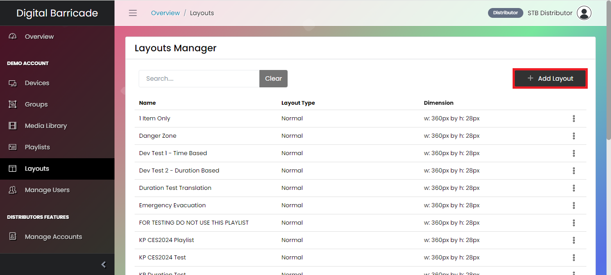

Supply the desired name of the layout. Choose a layout type between Normal and Areas. 

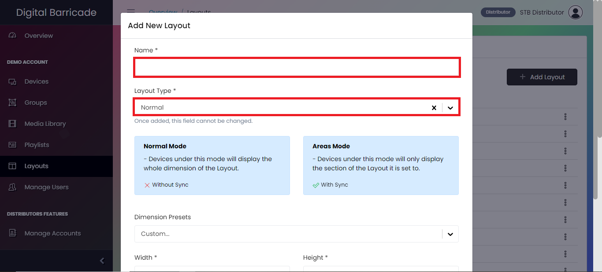

Choose any dimension presets available from the dropdown. Before pressing the save button, set the width and height of the layout.

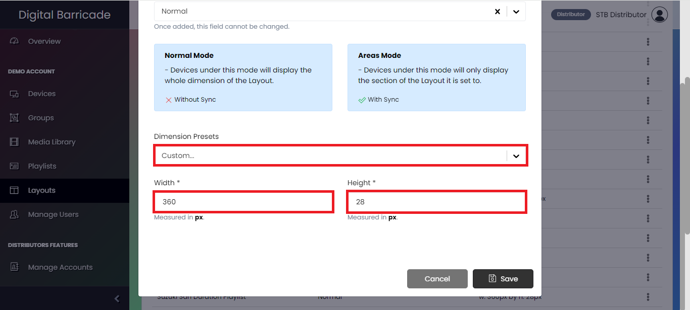

# Edit Layout Settings

To configure a layout, press the edit layout settings option under the dropdown.

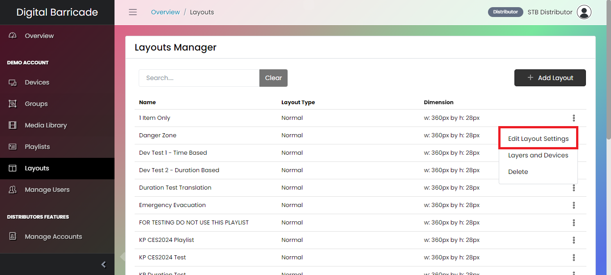

Once the modal appears, configure and update any of the fields available except for the layout type as it remains to default based on the layout type chosen when the layout is created.

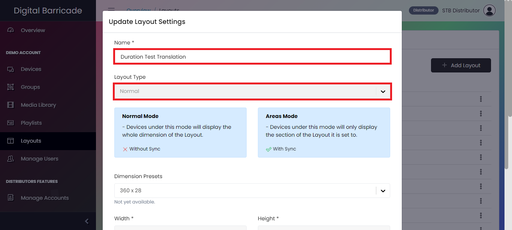
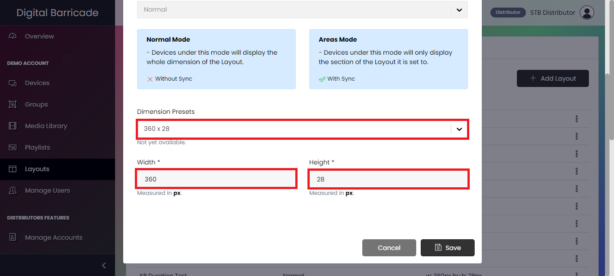

# Layers and Devices

To navigate to the created layout and add layers, devices, and device groups, press the layers and devices option of the selected layout.

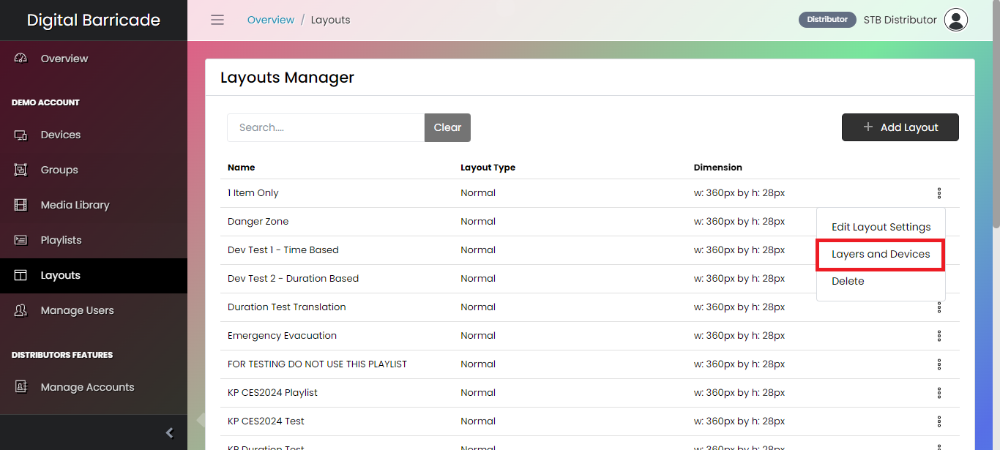

The default active tab is the Layers which consists of text, media, and playlist layers.

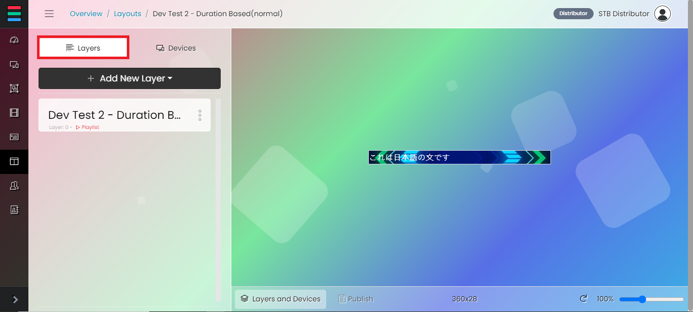

To add devices or device groups, navigate to the Devices tab.

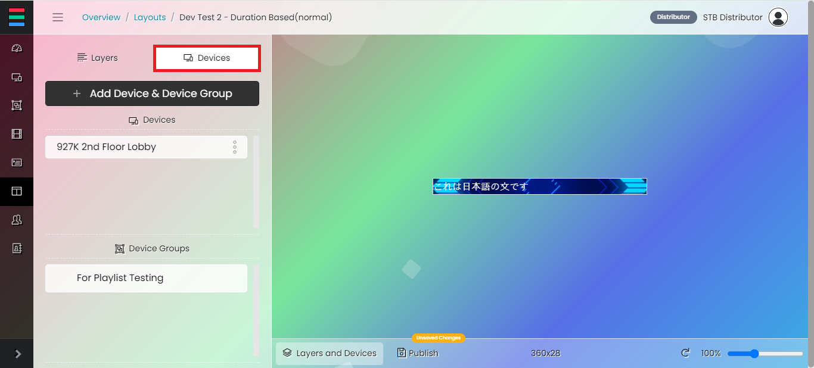

To add a new text layer, press the text option under the dropdown after pressing the add new layer button.

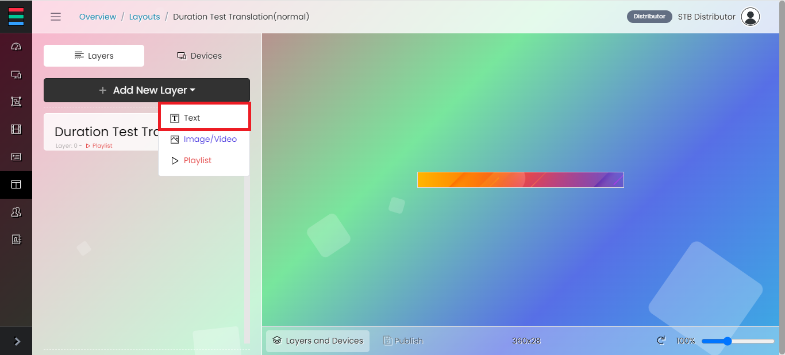

When the modal appears, provide the name of the layer. The text can be translated to a different language but the options are only limited. The user can set the text if it is active or not, in reverse or not. To set the initial position of the layer, set the value of x and y. To change the size of the layer, change the default value of width and height. Select the desired, font size, font style, font color, and background color of the text layer. 

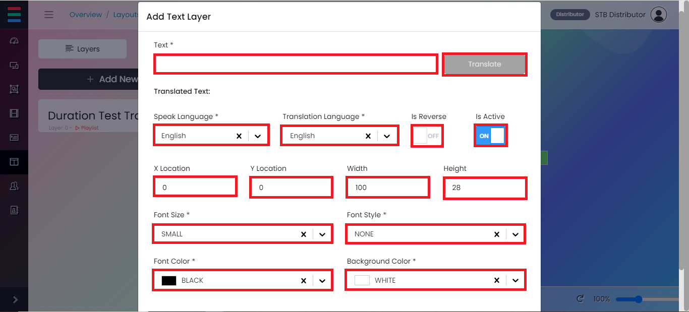

To add a new media layer, press the image/video option under the dropdown after pressing the add new layer button.

The uploaded medias in the media library will be shown in the modal when the user adds a media layer.

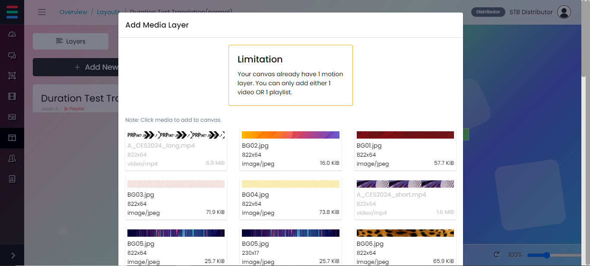

To add a new playlist layer, press the playlist option under the dropdown after pressing the add new layer button.

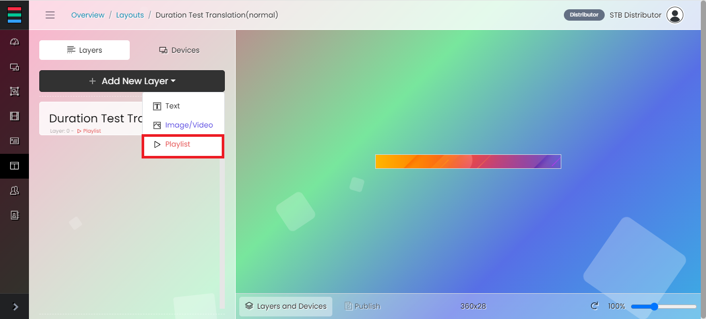

The created playlist from the playlist page can be used in the layout to play multiple medias combined with image and text.

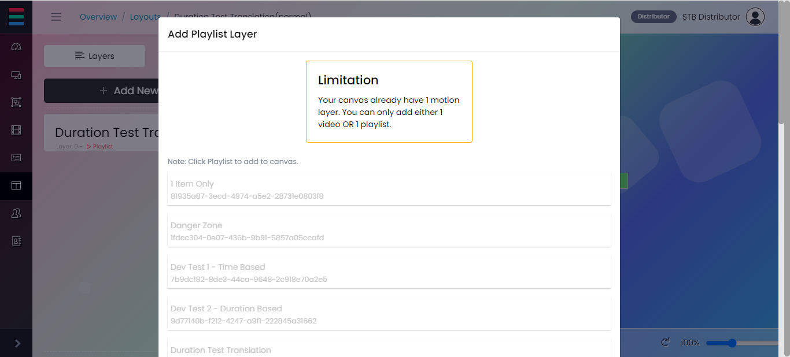

To edit a layer, click the 3-dot icon and an edit option will be shown. 

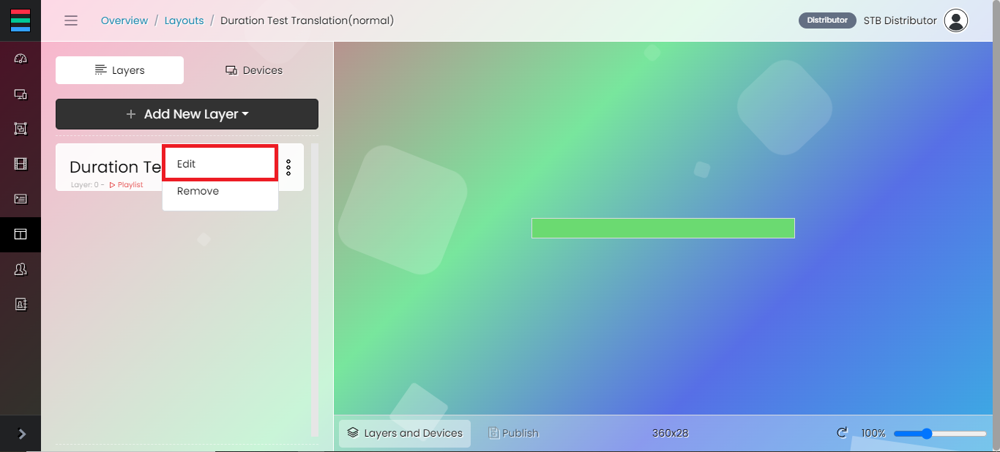

The layers can be configured using the given options on the tab. 

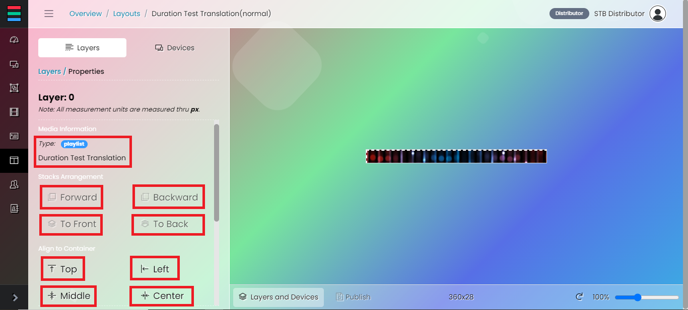

To apply the changes, press the Apply Dimension and Position button before pressing the Publish button. If the layout has a bigger dimension, the user can use the slidebar to adjust the view so that the whole layout can be seen.

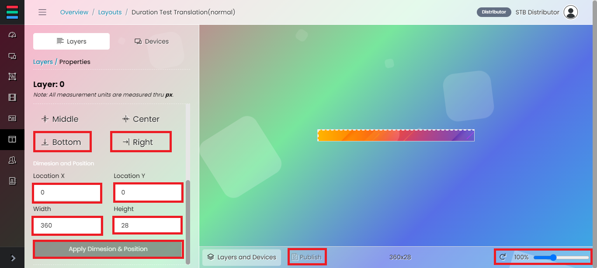

To remove a layer, click the 3-dot icon and a remove option will be shown. 

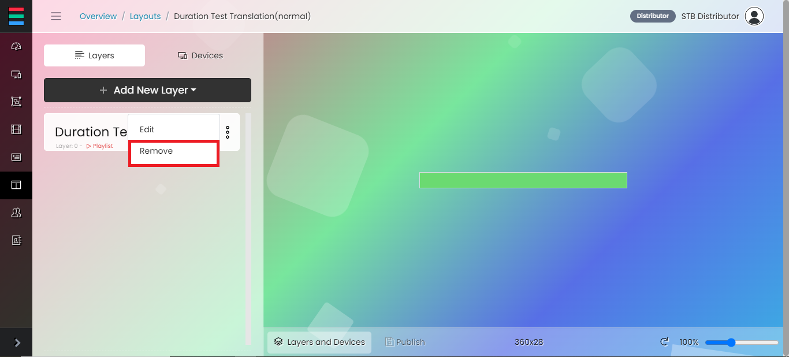

# Delete Layout

To delete a layout, choose a layout then click the 3-dot icon and press the delete option from the dropdown menu.

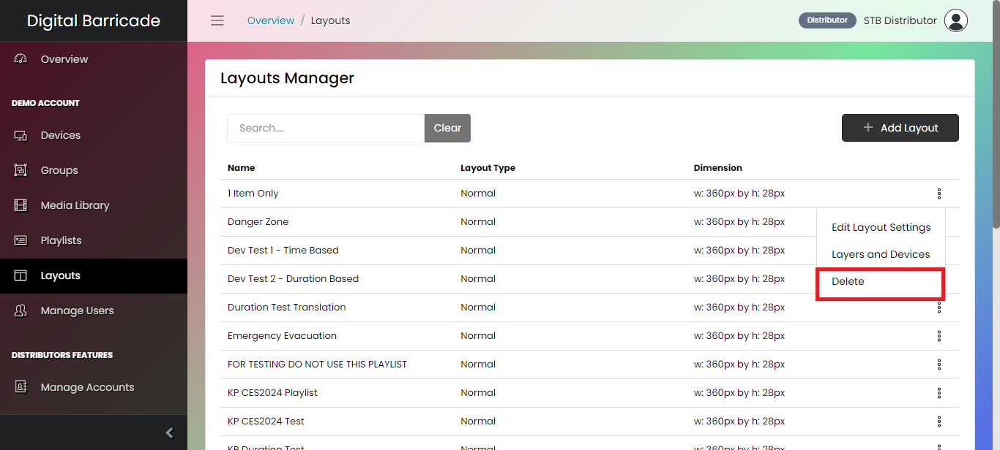

When the modal appears, press the continue delete button.

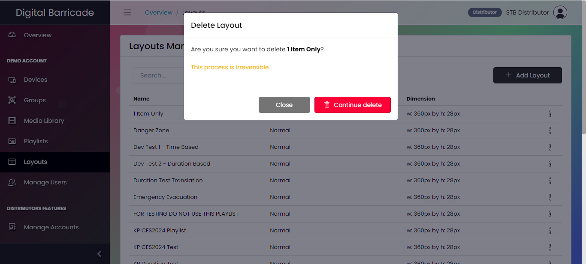

