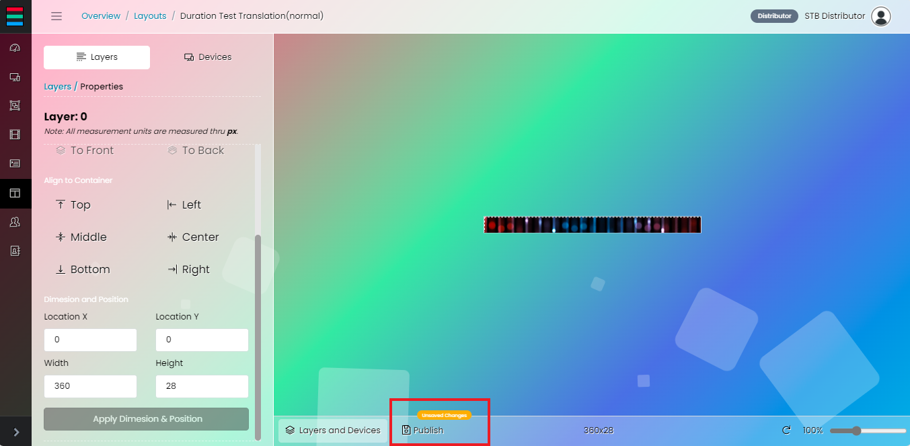

# 레이아웃 관리자

레이아웃 관리 페이지는 디지털 미디어를 편집, 배열 및 구성하여 배포할 준비가 된 레이아웃으로 만들 수 있도록 설계되었습니다. 여기에는 텍스트, 이미지, 동영상, 재생 목록 등 다양한 미디어 유형을 처리할 수 있는 캔버스가 제공됩니다. 이러한 미디어는 두 가지 레이아웃 유형 중 하나로 구성할 수 있습니다: 디바이스에 전체 레이아웃을 표시하는 일반 모드와 주로 동기화된 디스플레이를 위해 미리 정의된 영역 내에 미디어를 배치하는 영역 모드가 있습니다. 그런 다음 레이아웃을 특정 디바이스 또는 디바이스 그룹에 게시할 수 있습니다.

# 레이아웃 추가

새 레이아웃을 추가하려면 레이아웃 추가 버튼을 클릭하기만 하면 모달이 나타납니다.

원하는 레이아웃의 이름을 입력합니다. 일반과 영역 중에서 레이아웃 유형을 선택합니다. 레이아웃 유형 선택은 레이아웃을 만드는 동안에만 이루어지며 편집 모드에서는 변경할 수 없습니다.

드롭다운에서 사용 가능한 치수 사전 설정을 선택합니다. 저장 버튼을 누르기 전에 레이아웃의 너비와 높이를 설정합니다.

# 레이아웃 설정 편집

레이아웃을 구성하려면 드롭다운 아래의 레이아웃 설정 편집 옵션을 누릅니다.

모달이 나타나면 레이아웃을 만들 때 선택한 레이아웃 유형에 따라 기본값으로 유지되므로 레이아웃 유형을 제외한 사용 가능한 필드를 구성하고 업데이트합니다.

# 레이어 및 디바이스

생성한 레이아웃으로 이동하여 레이어, 디바이스 및 디바이스 그룹을 추가하려면 선택한 레이아웃의 레이어 및 디바이스 옵션을 누릅니다.

# 레이어

기본 활성 탭은 텍스트, 미디어 및 재생 목록 레이어로 구성된 레이어입니다.

새 텍스트 레이어를 추가하려면 새 레이어 추가 버튼을 누른 후 드롭다운 아래의 텍스트 옵션을 누릅니다.

모달이 나타나면 레이어의 이름을 입력합니다. 텍스트는 다른 언어로 번역할 수 있지만 옵션은 제한되어 있습니다. 사용자는 텍스트의 활성화 여부, 반전 여부 등을 설정할 수 있습니다. 레이어의 초기 위치를 설정하려면 x 및 y 값을 설정하고, 레이어의 크기를 변경하려면 기본값인 너비와 높이를 변경합니다. 텍스트 레이어의 원하는 글꼴 크기, 글꼴 스타일, 글꼴 색상 및 배경색을 선택합니다.

새 미디어 레이어를 추가하려면 새 레이어 추가 버튼을 누른 후 드롭다운 아래의 이미지/동영상 옵션을 누릅니다.

사용자가 미디어 레이어를 추가하면 미디어 라이브러리에 업로드된 미디어가 모달에 표시됩니다.

새 재생목록 레이어를 추가하려면 새 레이어 추가 버튼을 누른 후 드롭다운 아래의 재생목록 옵션을 누릅니다.

재생목록 페이지에서 생성한 재생목록을 레이아웃에 사용하여 이미지 및 텍스트와 결합된 여러 미디어를 재생할 수 있습니다.

레이어를 편집하려면 점 3개 아이콘을 클릭하면 편집 옵션이 표시됩니다.

탭에서 주어진 옵션을 사용하여 레이어를 구성할 수 있습니다. 

일부 설정(변경 시)은 캔버스에 자동으로 적용되지 않습니다. 변경 사항을 적용하려면 '치수 및 위치 적용' 버튼을 누르세요. 레이아웃의 치수가 더 큰 경우 사용자는 슬라이드바를 사용하여 전체 레이아웃을 볼 수 있도록 보기를 조정할 수 있습니다.

# 일반 모드의 장치(동기화하지 않음)

디바이스 탭(일반 모드 아래)에서 개별 디바이스와 디바이스 그룹을 모두 추가할 수 있는 옵션이 있습니다. 추가된 디바이스는 동기화 없이 레이아웃 캔버스의 전체 영역을 표시합니다.

# 영역 모드의 장치(동기화 사용)

디바이스 탭(영역 모드 아래)에는 개별 디바이스만 추가할 수 있는 옵션이 있습니다. 추가된 디바이스는 지정한 레이아웃 캔버스의 영역에 표시됩니다.

처음 추가된 디바이스는 동일한 네트워크에 연결된 모든 디바이스의 '컨트롤러'로 지정됩니다. 컨트롤러를 변경하려면 점 3개 아이콘을 클릭하고 메뉴에서 '컨트롤러로 설정' 옵션을 선택합니다.

점 3개 아이콘을 클릭하고 메뉴에서 '편집' 옵션을 선택하여 레이아웃 캔버스에서 디바이스의 위치와 크기를 업데이트할 수도 있습니다.

# 콘텐츠 배포를 위한 게시

변경 사항이 있을 때마다 게시 버튼에 노란색 배지가 나타납니다. 이 버튼을 클릭하면 수정 사항이 저장되고 지정한 장치에 배포됩니다.

# 레이아웃 삭제

레이아웃을 삭제하려면 레이아웃을 선택한 다음 점 3개 아이콘을 클릭하고 드롭다운 메뉴에서 삭제 옵션을 누릅니다.

모달이 나타나면 삭제 계속 버튼을 누릅니다.

