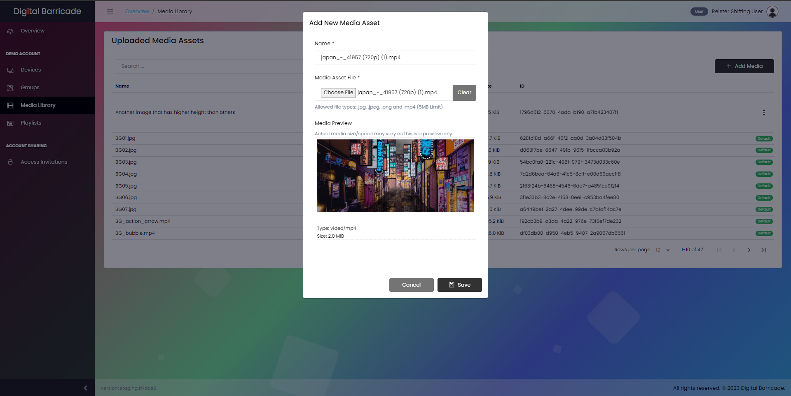
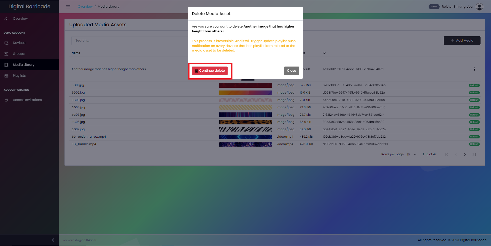

# 미디어 관리

사용자는 패널의 미디어 라이브러리 탭을 통해 이미지와 동영상으로 구성된 업로드된 미디어에 액세스할 수 있습니다. 업로드된 미디어는 새 재생 목록을 만드는 데 사용됩니다.

# 미디어 자산 추가

사용자는 미디어 추가 버튼을 선택하고 원하는 미디어의 이름과 유형(사진 또는 동영상)을 입력하여 새 미디어를 업로드할 수 있습니다. 미디어를 추가하려면 그림에 표시된 대로 미디어 추가 버튼을 클릭합니다.

사용자가 파일 선택 버튼을 누르면 모달 창이 나타나고 업로드할 미디어 파일을 선택할 수 있습니다. 또한 지우기를 클릭하여 해당 파일을 제거하고 다른 파일을 선택할 수도 있습니다. 저장을 클릭하여 미디어 파일을 확인합니다.

# 미디어 자산 편집

업로드한 미디어를 변경하려면 드롭다운 메뉴에서 편집 옵션을 선택하기만 하면 됩니다. 사용자는 미디어의 이름을 변경할 수 있지만 업로드된 미디어 자체를 변경할 수는 없습니다.

미디어 이름에 대한 변경 사항을 저장하려면 변경 사항 저장 버튼을 클릭합니다.

# 미디어 자산 삭제

편집 옵션에서 사용자는 사용자 지정 미디어를 삭제할 수 있습니다. 이렇게 하려면 삭제 옵션을 선택하면 미디어 삭제를 확인하는 모달 창이 열리고 삭제 계속 버튼을 클릭합니다.

