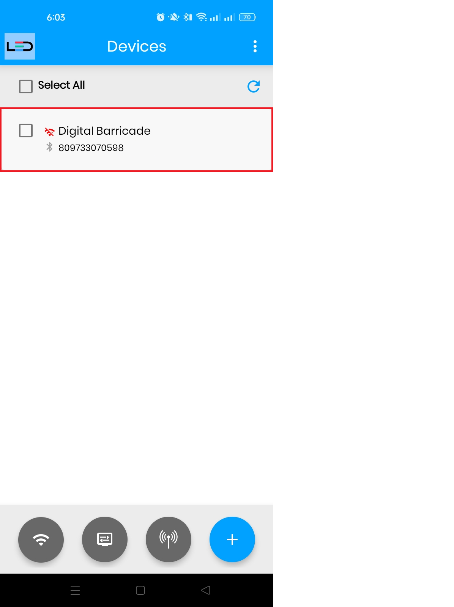
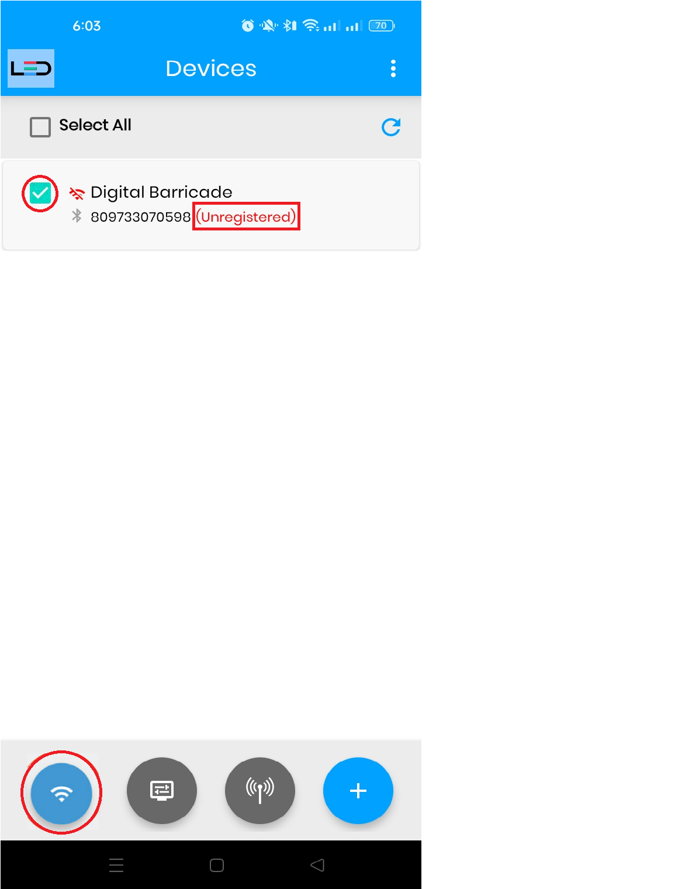
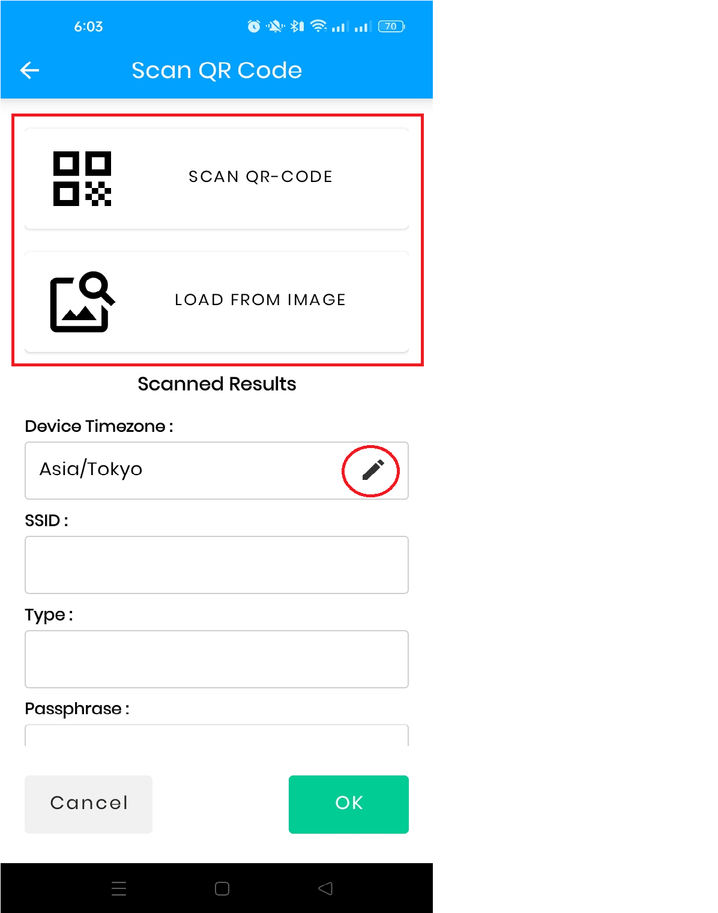
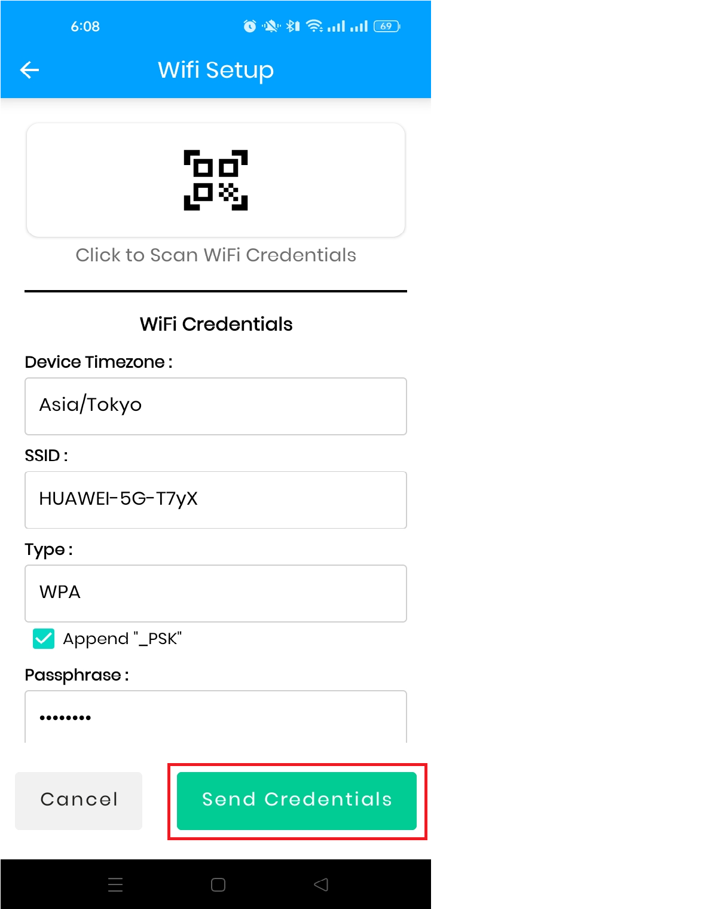
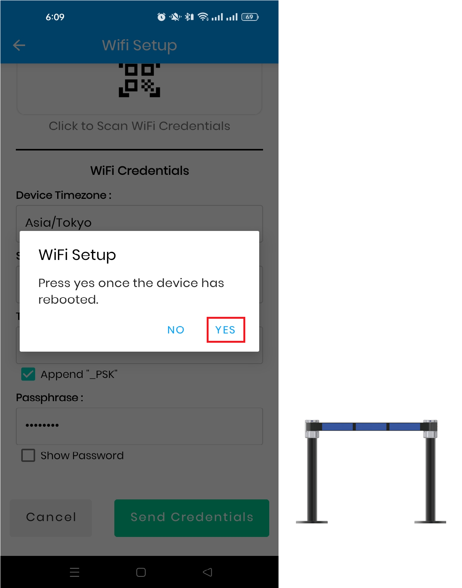
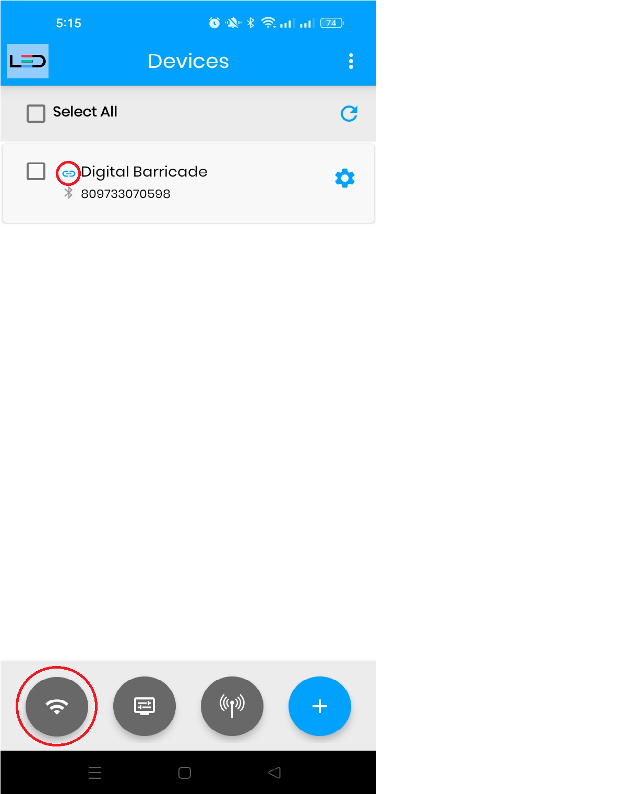
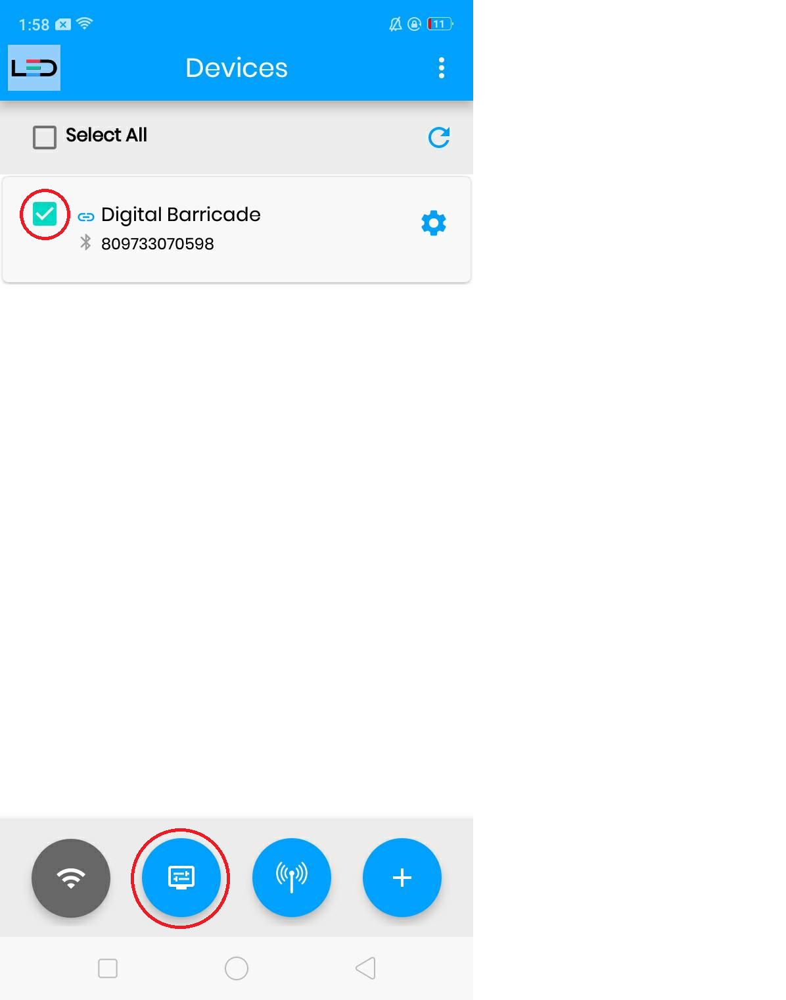
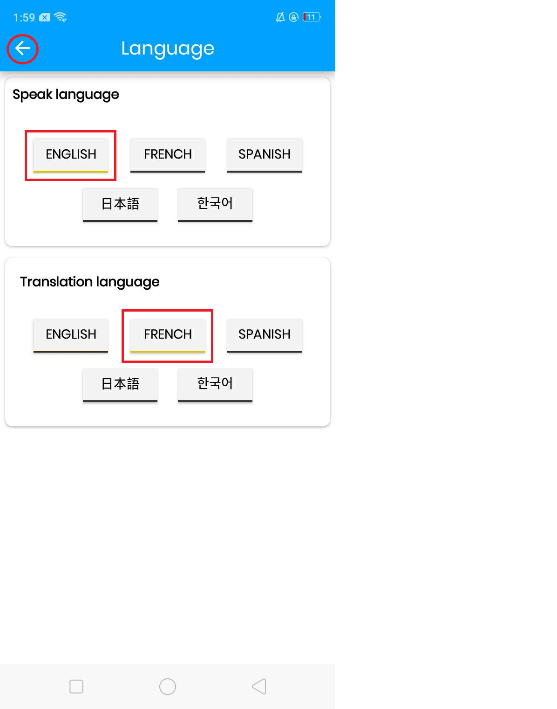
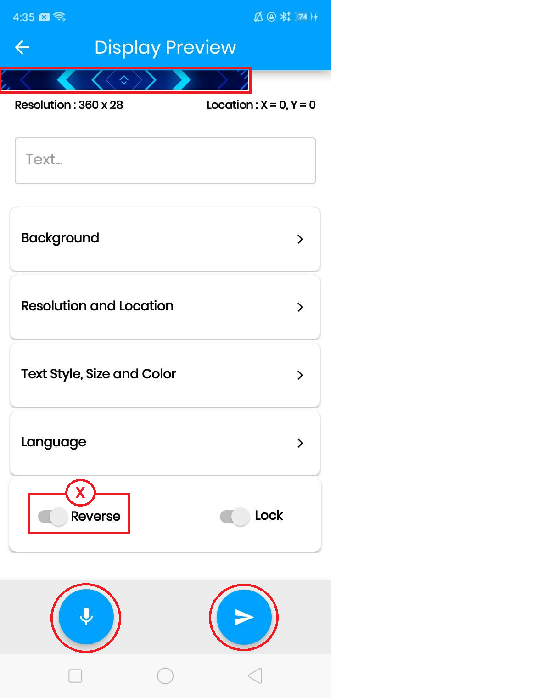

# 디지털 LED 바리케이드 - 모바일 애플리케이션 사용 가이드

  

  
KOREAN Ver 1.1

# 로그인
총판 또는 계정 관리자가 제공한 로그인 자격 증명을 사용하여 모바일 앱에 로그인합니다. 일반적으로 계정 초대가 이메일로 전송되며, 여기에서 비밀번호를 설정할 수 있습니다.

등록된 이메일 주소와 비밀번호를 입력한 후 "로그인" 버튼을 탭합니다.

# 디바이스 설정
"디바이스 검색 중"이라는 메시지가 표시됩니다. 처음 사용할 때는 디바이스 등록이 필요합니다. 오른쪽 하단의 "+" 버튼을 탭합니다.

오른쪽 하단의 "+" 버튼을 탭합니다.

__참고:__ 장치가 표시되기까지 다소 시간이 걸릴 수 있으며 장치가 장치 목록에 표시되기까지 다소 시간이 걸릴 수 있습니다.

그러면 앱이 디바이스를 검색하고 "DBAP0001" 네트워크가 표시됩니다.

"DBAP0001" 네트워크를 탭하면 장치 목록에서 연결된 장치를 볼 수 있습니다.

# WiFi 자격 증명 설정하기
장치 목록에서 핫스팟을 사용하여 연결한 장치를 확인/선택하여 장치 WiFi를 구성합니다.

장치를 확인합니다. (여러 장치를 확인/선택할 수 있습니다.)

왼쪽 하단의 첫 번째 버튼을 탭합니다.

__참고:__ 장치에 처음 등록하면 미등록 메시지가 표시됩니다.

장치에 처음 연결할 때 시간대를 선택해야 합니다.

__참고:__ 시간대 설정은 장치를 처음 등록할 때만 수행됩니다.

'QR코드 스캔' 또는 '이미지에서 로드' 버튼을 탭하여 연결하려는 WiFi의 QR 코드를 스캔합니다. 아래의 "옵션 1" 또는 "옵션 2"를 확인하여 QR코드 스캔 방법을 알아보세요.

__참고:__ 처음 등록할 때 연필 아이콘 버튼을 클릭하여 시간대를 변경할 수 있습니다.

## 옵션 1: 카메라에서 WiFi QR코드 스캔하기

'QR코드 스캔' 버튼을 누르면 와이파이 QR 코드를 스캔할 수 있습니다.

"QR 코드 스캔" 버튼을 탭하여 카메라로 QR 코드를 스캔하면 WiFi 자격 증명을 받습니다. 마지막으로 "확인" 버튼을 탭합니다.

## 옵션 2 : 휴대폰 갤러리의 이미지에서 WiFi QR 코드 스캔하기

휴대폰 갤러리에 WiFi QR코드 이미지가 있는 경우 앱이 이미지를 스캔합니다.

"이미지에서 로드" 버튼을 탭하여 휴대폰 갤러리에서 QR 코드를 스캔한 다음 WiFi 자격 증명을 가져옵니다. 마지막으로 "확인" 버튼을 탭합니다.

"자격 증명 보내기" 버튼을 탭합니다.

"WiFi 설정" 팝업이 나타나고 기기가 자동으로 재부팅됩니다. "예"를 탭합니다. 그러면 모바일 앱이 자동으로 재시작되고 장치 목록 화면으로 이동합니다.

장치의 WiFi 구성이 완료되었습니다. 장치 재부팅이 완료되면 장치가 등록되고 WiFi를 통해 연결됩니다.

__참고:__ 장치가 장치 목록에 나타나려면 40~50초 정도 걸립니다. 장치가 한 번 더 재부팅될 수 있습니다. WiFi에 연결 버튼이 비활성화됩니다.

# 콘텐츠 제어
장치 목록에서 구성하려는 장치를 선택한 다음 하단의 두 번째 아이콘을 선택하면 디스플레이의 콘텐츠를 제어할 수 있습니다.

제어하려는 장치를 확인한 다음 하단의 두 번째 버튼을 탭합니다.

## 장치 미리 보기 인터페이스

장치 미리 보기의 인터페이스는 다음과 같습니다:
- 디지털 LED 바리케이드 미리보기 화면
- 화면 해상도
- 텍스트 필드
- 디지털 LED 바리케이드 화면의 배경색을 선택할 수 있습니다.
- 화면 해상도 및 위치 변경 가능
__주의:__ 변경하기 전에 반드시 제조사에 문의해야 합니다. 사전 문의 없이 변경 시 발생하는 오류에 대해 제조사는 책임지지 않습니다.
- 텍스트 스타일, 크기, 색상 선택 가능
- 말하기 및 번역 언어 선택
- 스마트폰 화면의 불필요한 터치 방지
- 디지털 LED 바리케이드 화면을 180도 반전 가능
- 기기에 콘텐츠 전송
- 이 "마이크"버튼을 눌러 언어 말하기

### 1. 텍스트 표시

"언어"를 탭합니다.

언어 말하기를 선택합니다. 그런 다음 번역 언어를 선택합니다(말하기 언어와 동일한 언어를 선택할 수 있음). 디스플레이 미리보기로 돌아갑니다.

선택한 말하기 언어로 언어를 말하는 동안 "마이크" 버튼을 길게 누릅니다.

선택한 번역 언어로 번역된 언어가 미리보기 화면과 텍스트 필드에 표시됩니다. 텍스트를 반전하려면 "반전" 버튼을 켭니다. 텍스트를 장치로 보냅니다.  

그러면 디지털 LED 바리케이드의 화면에서 텍스트를 볼 수 있습니다. 또는 다른 텍스트 스타일, 크기, 색상 및 배경으로 텍스트를 표시할 수 있습니다.

### 2. 텍스트 스타일, 크기 및 색상 변경하기

"텍스트 스타일, 크기 및 색상"을 탭합니다.

글꼴 크기를 선택합니다. 글꼴 스타일을 선택합니다(두 가지 스타일을 모두 선택할 수 있습니다). 6가지 옵션 중에서 글꼴 색상을 선택합니다. 그런 다음 미리 보기 표시로 돌아갑니다.

콘텐츠를 디바이스로 전송합니다.

### 3. 배경 변경
> 배경 색상

"배경"을 탭합니다.

배경 선택 항목에서 "색상"을 선택한 다음 6가지 옵션 중에서 하나의 배경 색상을 선택합니다. 디스플레이 미리 보기로 돌아갑니다.

콘텐츠를 디바이스로 전송합니다.

> 배경 이미지

배경 선택 항목에서 '이미지'를 선택한 다음 '이미지 선택'을 탭합니다. 휴대폰 갤러리에서 표시할 이미지를 선택합니다.

선택한 이미지를 확인할 수 있습니다. 미리보기 표시로 돌아갑니다.

배경 이미지가 로드된 것을 확인할 수 있습니다. 이미지를 반전하려면 '반전' 버튼을 켭니다. 콘텐츠를 장치로 전송합니다.

__참고:__ 음성을 텍스트로 입력할 수 있습니다. 이미지의 텍스트를 삭제하려면 '마이크' 버튼을 짧게 탭합니다. 그리고 콘텐츠를 다시 디바이스로 보냅니다.

> 배경 비디오

백그라운드 선택 항목에서 "비디오"를 선택한 다음 "비디오 선택"을 탭합니다. 휴대폰 갤러리에서 표시할 동영상을 선택합니다.

선택한 동영상을 확인할 수 있습니다. 미리보기 표시로 돌아갑니다.

배경 동영상이 로드된 것을 확인할 수 있습니다. 동영상은 되돌릴 수 없습니다. 콘텐츠를 장치로 보냅니다.

__참고:__ 음성을 텍스트로 입력할 수 있습니다. 동영상의 텍스트를 삭제하려면 '마이크' 버튼을 짧게 탭합니다.

# WiFi 자격 증명 재설정
WiFi 자격 증명을 재설정할 수 있습니다. 이 옵션은 다른 WiFi 자격 증명을 사용하는 다른 위치로 장치를 이동하는 데 사용됩니다.

장치를 확인합니다. (여러 장치를 확인/선택할 수 있습니다.) 

하단의 세 번째 아이콘을 탭합니다.

__주의:__ 새 WiFi 네트워크로 변경하기 전에 현재 연결된 WiFi 네트워크에서 WiFi 네트워크를 재설정해야 합니다.

확인 메시지가 나타나면 "예"를 탭합니다. 장치가 자동으로 재부팅되고 장치 목록 화면에서 해당 장치가 사라집니다. (장치가 자동으로 재부팅됩니다.)

장치가 재부팅되면 화면에 마지막으로 전송한 콘텐츠가 표시됩니다.  

오른쪽 하단의 "+" 버튼을 탭합니다. "장치 설정하기" 절차를 반복하고 "WiFi 자격 증명 설정하기" 절차를 반복합니다.

__참고:__ 두 번째 설정부터 시간대를 설정할 필요는 없습니다.

# 디바이스 이름 변경하기

"톱니바퀴" 아이콘을 탭합니다.

"장치 이름"을 탭합니다.

새 이름을 입력합니다. 그런 다음 "확인" 버튼을 탭합니다.

확인 메시지가 나타나면 "예"를 탭합니다.

# 블루투스 기능

"기어" 아이콘을 탭합니다.

"블루투스"를 탭합니다.

오른쪽 하단의 "검색" 버튼을 탭하여 장치를 검색합니다.

검색이 완료되면 사용 가능한 장치가 표시됩니다. 페어링할 디바이스를 선택하거나 선택합니다.

팝업이 나타나면 "페어링"을 탭합니다.

페어링이 완료되면 이제 '저장된 장치/이전 연결 장치'에 연결된 장치가 표시됩니다.

연결된 장치의 페어링을 해제하려면 다음과 같이 하세요. "저장된 장치/이전 연결 장치"에서 장치를 탭합니다.  

'페어링 해제' 버튼을 탭하여 장치를 페어링 해제합니다.

