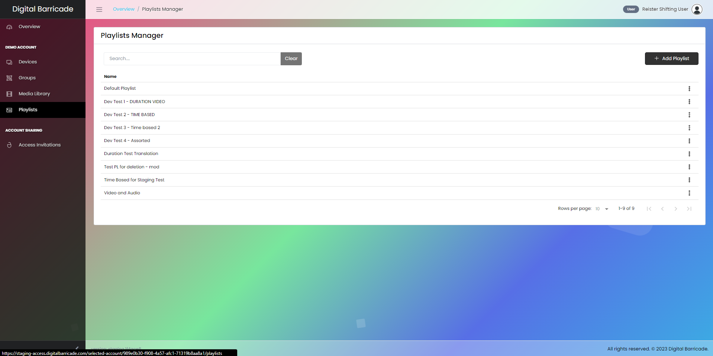
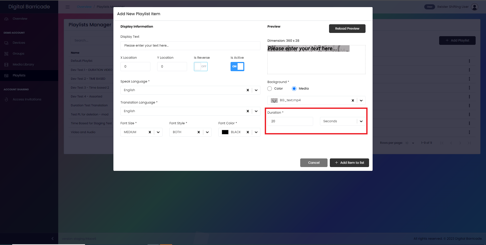

# 재생 목록 관리

재생 목록 관리자에는 그룹을 만들 때 사용되는 재생 목록이 포함되어 있으며 여기에서 업로드된 미디어가 활용됩니다. 재생 목록이 선택된 경우 왼쪽 패널에서 사용자에게 이 화면이 표시됩니다. 여기에서 사용자는 자신의 계정으로 생성되고 사용 가능한 모든 재생 목록을 볼 수 있습니다. 이 페이지에서 사용자는 새 재생 목록을 만들고 기존 재생 목록을 구성하고 재생 목록을 삭제할 수 있습니다.

# 재생 목록 만들기

새 재생 목록을 만들려면 그림에 표시된 것처럼 재생 목록 추가 버튼을 클릭하십시오.

사용자는 재생 목록의 이름과 표시 크기를 지정할 수 있습니다. 사용자가 재생 목록을 만들 때 재생 모드를 선택해야 합니다. 기본 기간이 20초인 기간 기반과 일정/시간 기반의 두 가지 옵션을 사용할 수 있습니다. 후자 모드에서 사용자는 재생 목록이 월요일부터 일요일까지 재생되는 시간표를 설정할 수 있습니다. 또한 사용자는 매일 재생 목록이 활성화되는 정확한 시간을 지정할 수 있습니다.

항목 추가 버튼을 클릭하면 재생 목록을 사용자 지정할 수 있는 다양한 옵션을 표시하는 새 창으로 이동합니다. 이러한 옵션에는 중요한 정보를 효과적으로 표시하는 표시 텍스트를 설정하는 기능이 포함됩니다. 사용자는 X 및 Y 좌표를 사용하여 표시 텍스트의 위치를 ​​조정할 수 있습니다. 또한 반전 스위치를 사용하여 디스플레이 방향을 반전시킬 수 있습니다. 재생 목록의 상태를 제어하기 위해 재생 목록이 현재 활성 상태인지 여부를 표시하는 활성 스위치가 있습니다.

또한 모달에는 사용자가 구어 및 문어 문장에 대해 원하는 언어를 선택할 수 있는 드롭다운 메뉴가 통합되어 자동 번역이 가능합니다. 사용자는 원하는 결과를 얻기 위해 글꼴 크기, 스타일 및 색상을 조정하여 표시된 텍스트의 모양을 사용자 정의할 수 있습니다. 또한 텍스트에 대해 다른 배경색을 선택하거나 업로드된 미디어 자산을 배경으로 사용하여 시각적 매력을 높일 수 있습니다. 변경 사항을 미리 보려면 미리 보기 다시 로드 버튼을 클릭하기만 하면 수정 사항이 적용된 디스플레이 텍스트가 어떻게 표시되는지 알 수 있습니다.

# 기간 기반

사용자가 기간 기반 옵션을 선택한 경우 이 모달 창이 나타나 언어, 표시할 텍스트, 글꼴 크기, 글꼴 스타일 및 글꼴 색상을 선택할 수 있으며 기간 기반의 경우 이 항목의 기간이 표시됩니다/ 장치에서 재생합니다.

사용자가 자신이 변경한 내용을 확인하려면 미리 보기 생성 버튼을 눌러 변경 내용을 미리 보고 재생 목록에 항목을 추가하려면 목록에 항목 추가 버튼을 눌러야 합니다.

# 일정/시간 기반

사용자가 일정/시간 기반 옵션을 선택한 경우 이 모달 창이 나타나 언어, 표시할 텍스트, 글꼴 크기, 글꼴 스타일, 글꼴 색상 및 일정/시간 기반 요일을 선택할 수 있습니다. 항목의 특정 시작 및 종료 시간이 재생됩니다.

사용자가 자신이 변경한 내용을 확인하려면 미리 보기 생성 버튼을 눌러 변경 내용을 미리 보고 재생 목록에 항목을 추가하려면 목록에 항목 추가 버튼을 눌러야 합니다.

그런 다음 사용자가 수정 사항에 만족하면 새로 만든 재생 목록을 추가/저장합니다. 저장 버튼을 클릭합니다.

# 재생 목록 편집

편집 옵션을 선택하면 사용자는 이 모달 창으로 이동하여 재생 목록의 이름, 표시 크기 및 재생 모드를 변경하고 시간 기반 재생 목록의 시간 변경 또는 지속 시간 변경과 같은 개별 항목을 편집할 수 있습니다. - 기반 재생 목록.

재생 목록에 대한 변경 사항을 저장하려면 변경 사항 저장 버튼을 클릭하십시오. 이렇게 하면 이 재생 목록이 있는 장치가 콘텐츠를 자동으로 업데이트합니다.

# 재생 목록 삭제

편집 옵션에서 사용자는 재생 목록을 삭제할 수 있습니다. 이렇게 하려면 삭제 옵션을 선택한 다음 모달 창을 열어 재생 목록 삭제를 확인하고 계속 삭제 버튼을 클릭합니다.

