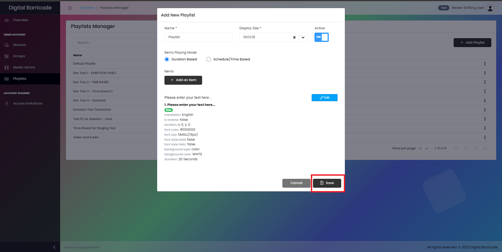

# 재생 목록 관리

재생목록 관리자에는 그룹을 만들 때 사용되는 재생목록이 포함되어 있으며 업로드된 미디어가 여기에서 활용됩니다. 왼쪽 패널에서 재생목록을 선택한 경우 사용자에게 이 화면이 표시됩니다. 이 화면에서 사용자는 자신의 계정에서 생성된 모든 재생목록과 사용 가능한 재생목록을 볼 수 있습니다. 이 페이지에서 사용자는 새 재생목록을 만들고, 기존 재생목록을 구성하고, 재생목록을 삭제할 수 있습니다.

# 재생 목록 만들기

새 재생목록을 만들려면 그림에 표시된 대로 재생목록 추가 버튼을 클릭합니다.

사용자는 재생목록의 이름과 표시 크기를 지정할 수 있는 옵션이 있습니다. 사용자가 재생 목록을 만들 때 재생 모드를 선택해야 합니다. 기본 재생 시간이 20초인 재생 시간 기반과 일정/시간 기반 두 가지 옵션을 사용할 수 있습니다. 후자의 모드에서 사용자는 월요일부터 일요일까지 재생 목록을 언제 재생할지 시간표를 설정할 수 있습니다. 또한 사용자는 재생 목록이 활성화될 요일별 정확한 시간을 지정할 수 있습니다.

항목 추가 버튼을 클릭하면 재생목록을 사용자 지정할 수 있는 다양한 옵션이 표시된 새 창으로 이동합니다. 이러한 옵션에는 중요한 정보를 효과적으로 표시할 수 있는 표시 텍스트를 설정하는 기능이 포함됩니다. 사용자는 X 및 Y 좌표를 사용하여 표시 텍스트의 위치를 조정할 수 있습니다. 또한 반전 스위치를 사용하여 디스플레이 방향을 반전할 수도 있습니다. 재생 목록의 상태를 제어하기 위해 재생 목록이 현재 활성화되어 있는지 여부를 표시하는 활성 스위치가 있습니다.

또한 이 모달에는 사용자가 음성 및 서면 문장에 대해 원하는 언어를 선택할 수 있는 드롭다운 메뉴가 통합되어 있어 자동 번역이 가능합니다. 사용자는 글꼴 크기, 스타일 및 색상을 조정하여 표시되는 텍스트의 모양을 사용자 지정하여 원하는 결과를 얻을 수 있습니다. 또한 텍스트의 배경색을 다르게 선택하거나 업로드한 미디어 자산을 배경으로 사용하여 시각적 효과를 높일 수 있습니다. 변경 사항을 미리 보려면 미리 보기 다시 로드 버튼을 클릭하면 수정 사항이 적용된 디스플레이 텍스트가 어떻게 표시되는지 확인할 수 있습니다.

# 기간 기반

사용자가 기간 기반 옵션을 선택한 경우 이 모달 창이 나타나 언어, 표시할 텍스트, 글꼴 크기, 글꼴 스타일 및 글꼴 색상을 선택할 수 있으며, 기간 기반의 경우 이 항목의 지속 시간이 장치에 표시/재생됩니다.

사용자가 변경 사항을 확인하려면 미리보기 생성 버튼을 눌러 변경 사항의 미리 보기를 확인해야 합니다. 재생 목록에 항목을 추가하려면 목록에 항목 추가 버튼을 눌러야 합니다.

# 일정/시간 기반

사용자가 일정/시간 기준 옵션을 선택한 경우 이 모달 창이 나타나 언어, 표시할 텍스트, 글꼴 크기, 글꼴 스타일, 글꼴 색상을 선택할 수 있으며 일정/시간 기준 요일과 항목의 특정 시작 및 종료 시간을 재생할 수 있습니다.

사용자가 변경 사항을 확인하려면 미리보기 생성 버튼을 눌러 변경 사항의 미리 보기를 확인해야 합니다. 재생 목록에 항목을 추가하려면 목록에 항목 추가 버튼을 눌러야 합니다.

그런 다음 저장 버튼을 클릭하여 새로 생성한 재생목록을 추가/저장합니다.

# 재생목록 편집

편집 옵션을 선택하면 사용자는 이 모달 창으로 이동하여 재생 목록의 이름, 표시 크기 및 재생 모드를 변경하고 시간 기반 재생 목록의 시간 변경 또는 지속 시간 기반 재생 목록의 지속 시간 변경과 같은 개별 항목을 편집할 수 있습니다.

변경사항 저장 버튼을 클릭하여 재생목록의 변경사항을 저장합니다. 그러면 어떤 디바이스에서든 재생목록이 자동으로 업데이트됩니다.

# 재생목록 삭제

수정 옵션에서 사용자는 재생목록을 삭제할 수 있습니다. 이렇게 하려면 삭제 옵션을 선택하면 모달 창이 열리고 재생 목록 삭제를 확인할 수 있습니다. 삭제 계속 버튼을 클릭합니다.

