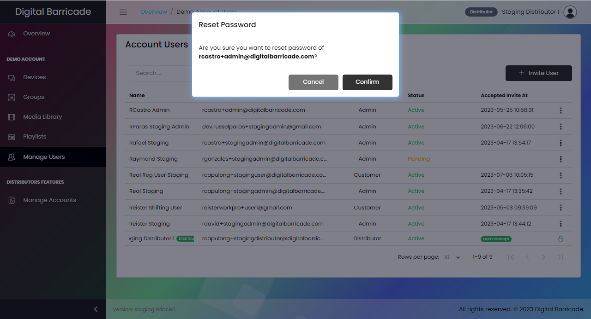

!> 계정을 삭제할 수 있는 권한은 *관리자*에게만 있습니다.

# 계정 사용자 관리

패널의 사용자 관리 탭에서 관리자는 각 계정 사용자를 모니터링할 수 있습니다. 여기에서 관리자는 각 계정 사용자의 이름, 이메일, 특정 역할 및 상태를 볼 수 있습니다.

사용자 계정과 관리자 계정은 서로 약간 다릅니다. 사용자 계정에서는 계정 공유에 액세스할 수 없지만 관리자 계정에서는 액세스할 수 있으므로 어떤 계정이 공유되었는지 확인할 수 있습니다. 사용자 계정에서는 디바이스, 그룹, 미디어 라이브러리 및 재생 목록에만 액세스할 수 있습니다.

# 새 사용자 초대

관리자는 계정 사용자 인터페이스에서 사용자 초대하기 버튼을 클릭하여 새 사용자를 추가할 수 있습니다. 그러면 관리자가 사용자의 이름과 이메일 주소를 입력하고 사용자 또는 관리자 중 역할을 선택해야 하는 모달이 나타납니다. 새로 초대된 사용자 계정은 주어진 역할로 제한된 디지털 바리케이드 웹사이트를 탐색할 수 있습니다.

# 사용자 계정 수정

관리자는 사용자/고객 및 관리자 계정의 비밀번호를 업데이트, 삭제, 재설정하는 등 계정을 관리할 수 있습니다.

관리자는 선택한 사용자 계정의 이름을 변경하고 관리자에서 사용자로 또는 그 반대로 역할을 업데이트할 수 있습니다.

# 사용자 계정 삭제

드롭다운 메뉴에서 삭제 옵션을 클릭한 후 모달이 나타나면 관리자는 선택한 사용자 계정을 삭제할 수 있습니다.

# 비밀번호 재설정

관리자는 아이콘을 클릭한 후 드롭다운이 나타나면 비밀번호 재설정 버튼을 클릭하여 선택한 계정의 비밀번호를 재설정할 수 있습니다. 비밀번호 재설정 메시지가 계정의 이메일로 전송됩니다.

